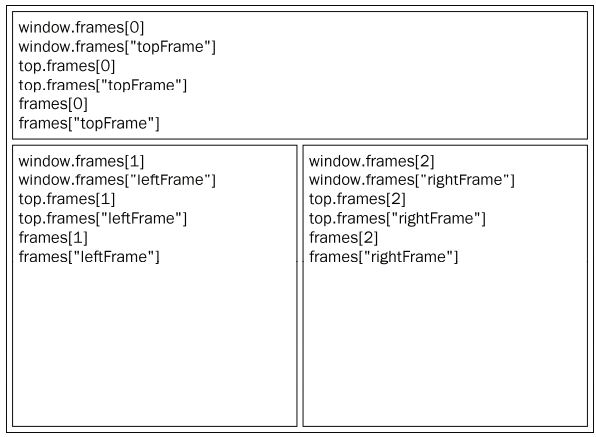

[TOC]

《JavaScript高级程序设计（第三版）》读书笔记
# 简介
一个完整的JavaScript实现由三部分组成：
- 核心(ECMAScript)
- 文档对象模型(DOM)
- 浏览器对象模型(BOM)

1. ECMAScript规定的内容：
- 语法
- 类型
- 语句
- 关键字
- 保留字
- 操作符
- 对象

2. 文档对象模型(DOM)
文档对象模型(DOM，Document Object Model)是针对XML但经过扩展用于HTML的应用程序编程接口(API，Application Programming Interface)。

    1. DOM级别：
    DOM1级由两个模块组成：DOM核心和DOM HTML。其中DOM核心规定的是如何映射基于XML的文档结构，以便简化对文档中任意部分的访问和操作。DOM HTML模块则在DOM核心的基础上加以扩展，添加了针对HTML的对象和方法。\
    DOM2级引入以下模块：
    - DOM视图：定义了跟踪不同文档(例如，应用CSS之前和之后的文档)视图的接口；
    - DOM事件：定义了事件和事件处理的接口；
    - DOM样式：定义了基于CSS为元素应用样式的接口；
    - DOM遍历和视图：定义了遍历和操作文档树的接口；
    
    DOM3引入了以统一方式加载和保存文档的方法——在DOM加载和保存模块中定义；新增了验证文档的方法——在DOM验证模块中定义。
      
    2. 其他DOM标准
    除了DOM核心和DOM HTML接口之外，另外几种语言还发布了只针对自己的DOM标准。
    - SVG(可伸缩矢量图)1.0
    - MathML(数学标记语言)1.0
    - SMIL(同步多媒体集成语言)
    
    3. Web浏览器对DOM的支持
3. 浏览器对象模型(BOM)
---
# 在HTML中使用JavaScript

1. `<script>`元素
向HTML页面插入JavaScript的主要方法，HTML4.01为`<script>`定义了下列6个属性：
- async：可选。表示应该立即下载脚本，但不应妨碍页面中的其他操作。只对外部脚本文件有效。
- charset：可选。表示通过src属性指定的代码的字符集。（大多数浏览器会忽略该值）
- defer：可选。表示脚本可以延迟到文档完全被解析和显示之后再执行。只对外部脚本文件有效。
- language：已废弃。
- src：可选。表示包含要执行代码的外部文件（如果需要包含JavaScript文件，则src属性就是必需的）。
- type：可选。可看做language的替代属性；表示编写代码使用脚本语言的内容类型（也称为MIME类型）。
    1. 标签的位置：现代Web应用程序一般都把全部JavaScript引用放在`<body>`元素中页面内容的后面。
    2. 延迟脚本：defer属性是表明脚本在执行时不会影响页面的构造。脚本被延迟到整个页面都解析完毕后再运行。defer属性只适用于外部脚本文件。
    3. 异步脚本：async脚本同样只用于外部脚本文件。
    4. 在XHTML中的用法：HTML的代码块在XHTML中无法正常识别，因为<在XHTML中被当做开始的新标签来解析。避免在XHTML中出现类似语法错误的方法有两个。一个是用相应的HTML实体(&lt替换<)；一个是用一个CDATA片段包含JavaScript代码`<script><![CDATA[代码片段]]></script>`

2. 嵌入外部代码与外部文件
- 可维护性：遍历不同HTML页面的JavaScript会造成维护问题。但把所有JavaScript文件都放在一个文件夹中，维护就方便多了。
- 可缓存：浏览器能够根据具体的设置缓存链接的所有外部JavaScript文件。
- 适应未来：通过外部文件来包含JavaScript无须使用前面提到XHTML或者注释hack。

3. 文档模式
混合模式（quirks mode）
标准模式（standards mode）：
```html
<!-- HTML 4.01严格型 -->
<!DOCTYPE HTML PUBLIC "-//W3C//DTD HTML 4.01//EN" "http://www.w3c.org/TR/html4/strict.dtd">
<!-- XHTML 1.0严格型 -->
<!DOCTYPE HTML PUBLIC "-//W3C//DTD XHTML 1.0 Strict//EN" "http://www.w3c.org/TR/xhtml/DTD/XHTML-strict.dtd">
<!-- HTML 5 -->
<!DOCTYPE HTML>
```
对于标准模式，则可以通过使用过渡型（transitional）或框架集型（frameset）文档类型来触发。
4. `<noscript>`模式
- 浏览器不支持脚本
- 浏览器支持脚本，但脚本被禁用

---
# 基本概念
## 语法
### 区分大小写

### 标识符
所谓标识符，就是指变量、函数、属性的名字，或者函数的参数。格式规则为：
- 第一个字符必须是一个字母、下划线（_）或一个美元符号（$）；
- 其他字符可以是字母、下划线、美元符号或数字。
- 不能把关键字、保留字、true、false和null用作标识符。

### 注释
ECMAScript使用C风格的注释，包括单行注释和块级注释。单行注释以两个斜杠开头。
块级注释以一个斜杠和一个星号（/*）开头，以一个星号和一个斜杠（*/）结尾。
```html
// 单行注释
/*
* 这是一个多行
* （块级）注释
*/
```

### 严格模式
```js
"use strict"
```
看起来是字符串，也没有赋值给任何变量，其实是一个编译指令。

### 语句
以分号结尾；如果省略分号，则由解释器确定语句的结尾。

## 关键字和保留字
```
abstract
boolean break byte
case catch char class const continue
debugger default delete do double 
else enum export extends
false final finally float for function
goto
if implements import in instanceof int interface
long let
native new null
package private protected public
return
short static super switch synchronized
this throw throws transient true try typeof
var volatile void
while with
yield
```


## 变量
用var操作符定义的变量将成为定义该变量的作用域中的局部变量。

## 数据类型
ECMAScript中有5种简单数据类型（基本数据类型）：Undefined、Null、Boolean、Number、String。一种复杂数据类型：Object

### typeof操作符

对一个值使用typeof操作符返回下列某个字符串：

- "undefined"——如果这个值未定义；
- "boolean"——如果这个值是布尔值；
- "string"——如果这个值是字符串；
- "number"——如果这个值是数值；
- "object"——如果这个值是对象或null；
- "function"——如果这个值是函数。
typeof操作符的操作数可以是变量，也可以是数值字面量。\
typeof是一个操作符而不是函数

### Undefined类型
Undefined类型只有一个值，即特殊的undefined。在使用var声明变量但未对其加以初始化时，这个变量的值就是undefined。

### Null类型
Null类型只有一个值，即特殊的null。null值表示一个空对象指针。
实际上，undefined值是派生自null值，因此对它们进行相等性测试返回true。
```js
alert(undefined == null); // true
alert(undefined === null); // false
```
### Boolean类型
Boolean类型只有两个字面值：true和false。区分大小写。这两个值与数字值不是一回事，true不一定等于1，false不一定等于0.
ECMAScript中所有类型的值都有与这两个Boolean值等价的值。要将一个值转换为其对应的Boolean值，可以调用转型函数Boolean()。

数据类型 | 转换为true的值 | 转换为false的值
--- | --- | ---
Boolean | true | false
String | 任何非空字符串 | ""(空字符串)
Number | 任何非零数字值(包括无穷大) | 0 和NaN
Object | 任何对象 | null
Undefined | n/a(不适用) | undefined

### Number类型
最基本的数值字面量格式是十进制整数。整数还可以通过八进制（以8为基数）或十六进制（以16为基数）的字面值来表示。\
其中，八进制字面量的第一位必须是零(0)，然后是八进制数字序列。十六进制字面值的前两位必须是0x，后跟任何十六进制数字(0-9及A-F)。
1. 浮点数值
所谓浮点数值，就是该数值中必须包含一个小数点，并且小数点后面必须至少有一位数字。虽然小数点前面可以没有整数，但我们不推荐这种写法。\
对于极大或极小的数值，可以用e表示法(即科学计数法)表示的浮点数值表示。
2. 数值范围
ECMAScript能够表示的最小数值保存在Number.MIN_VALUE中——在大多数浏览器中，这个值是5e-324；能够表示的最大数值保存在Number_MAX_VALUE中——在大多数浏览器中，这个值是1.7976931348623157e+308.
3. NaN
NaN,即非数值是一个特殊的数值。这个数值用于表示一个本来要返回数值的操作数未返回数值的情况。
NaN本身有两个非同寻常的特点。首先，任何涉及NaN的操作都会返回NaN；其次，NaN与任何值都不相等，包括NaN本身。

4. 数值转换
Number()可用于任何数据类型，其转换规则如下：
- 如果是Boolean值，true和false将分别被转换为1和0；
- 如果是数字值，只是简单的传入和返回；
- 如果是null值，返回0；
- 如果是undefined，返回NaN;
- 如果是字符串，遵循以下规则：
    - 如果字符串中只包含数字，则将其转换为十进制数值；
    - 如果字符串中包含有效的浮点格式，则将其转换为对应的浮点数值；
    - 如果字符串中包含有效的十六进制格式，则将其转换为相同大小的十进制整数值；
    - 如果字符产是空的（不包含任何字符），则将其转换为0；
    - 如果字符串中包含除上述格式之外的字符，则将其转换为NaN.
- 如果是对象，则调用对象的valueOf()方法，然后依照前面的规则转换返回的值。如果转换的结果是NaN,则调用对象的toString()方法，然后再次依照前面的规则转换返回的字符串值。

parseInt()函数在转换字符串时，会忽略字符串前面的空格，直到找到第一个非空格字符。如果第一个字符不是数字字符或者负号，parseInt()就会返回NaN;如果第一个字符是数字字符，则继续解析直到解析完或者遇到非数字字符。（小数点不是有效的数字字符）
parseInt提供第二个参数，转换时使用的基数（即多少进制）。

parseFloat()函数只解析十进制。

### String类型
String类型用于表示由零或多个16位Unicode字符组成的字符序列，即字符串。字符串可以由双引号(")或单引号(')表示。

1. 字符串变量
String数据类型包含一些特殊的字符字面量，也叫转义序列。

字面量 | 含义
--- | ---
`\n` | 换行
`\t` | 制表
`\b` | 退格
`\r` | 回车
`\f` | 进纸
`\\` | 斜杠
`\'` | 单引号(')，在用单引号表示的字符串中使用。
`\"` | 双引号(")，在用双引号表示的字符串中使用。
`\xnn` | 以十六进制代码nn表示的一个字符（其中n为0-F）。
`\unnnn` | 以十六进制代码nnnn表示的一个Unicode字符（其中n为0-F）。

2. 字符串的特点
ECMAScript中字符串是不可变的。

3. 转换为字符串
第一种是使用几乎每个值都有的toString()方法（null和undefined除外）。该方法可以不传递参数。但是，在调用数值的toString()方法时，可以传递一个参数：输出数值的基数。
第二种是String()，不知道转型的值是不是null和undefined时使用，转换规则如下：
- 如果值有toString()方法，则调用该方法并返回相应的结果；
- 如果值是null，则返回"null"；
- 如果值是undefined，则返回"undefined"。

### Object类型
ECMAScript中的对象其实就是一组数据和功能的集合。对象可以通过执行new操作符后跟要创建的对象类型的名称来创建。
Object的每个实例都具有下列属性和方法。
- constructor：保存着用于创建当前对象的函数。
- hasOwnproperty(propertyName)：用于检查给定属性在当前对象实例中（而不是在实例的原型中）是否存在。
- isPrototypeOf：用于检查传入的对象是否是传入对象的原型。
- propertyIsEnumerable(propertyName)：用于检查给定的属性是否能够使用for-in语句来枚举。
- toLocaleString()：返回对象的字符串表示，该字符串与执行环境的地区对应。
- toString()：返回对象的字符串表示。
- valueOf()：返回对象的字符串、数值或布尔值表示。

## 操作符
### 一元操作符
只能操作一个值的操作符叫做***一元操作符***。
1. 递增和递减操作符：前置型和后置型
2. 一元加和减操作符：表示正负

### 位操作符
位操作符用于最基本的层次上，即按内存中表示数值的位来操作数值。ECMAScript中所有数值都以IEEE-754 64
位格式储存，即位操作符并不直接操作64位的值。而是先将64位的值转换成32位的整数，然后执行操作，最后再转换回64位

对于有符号的整数，32位中的前31位用于表示整数的值。第32位用于表述数值的符号：0表示正数，1表示负数。
正数以纯二进制格式存储。负数同样以二进制码存储，但使用的格式是二进制补码。
1. 按位非（NOT）
按位非操作符有一个波浪线（~）表示，执行按位非的结果就是返回数值的反码（操作数的负数减1）。

2. 按位与（AND）
按位与操作符由一个和号字符（&）表示，它有两个操作符数。按位与操作就是将两个数值的每一位对齐，
然后根据下表中的规则，对相同位置上的两个数执行AND操作：

第一个数值的位 | 第二个数值的位 | 结果
--- | --- | ---
1 | 1 | 1
1 | 0 | 0
0 | 1 | 0
0 | 0 | 0

3. 按位或（OR）
按位或操作符由一个竖线符号（|）表示，有两个操作数。按位或操作遵循下面这个真假表。

第一个数值的位 | 第二个数值的位 | 结果
--- | --- | ---
1 | 1 | 1
1 | 0 | 1
0 | 1 | 1
0 | 0 | 0

4. 按位异或（XOR）
按位异或操作符由一个插入符号（^）表示，也是两个操作数。以下是按位异或的真假值。

第一个数值的位 | 第二个数值的位 | 结果
--- | --- | ---
1 | 1 | 0
1 | 0 | 1
0 | 1 | 1
0 | 0 | 0

5. 左移
左移操作符由两个小于号（<<）表示，这个操作符会将数值的所有位向左移动指定的位数。

6. 有符号的右移
有符号的右移操作符由两个小于号（>>）表示，这个操作符会将数值的所有位向右移动，但保留符号位（即正负号标记）。

7. 无符号右移
无符号的右移操作符由三个小于号（>>>）表示，这个操作符会将数值的所有32都位向右移动。


### 布尔操作符
布尔操作符一共有3个：非（NOT）、与（AND）和或（OR）
1. 逻辑非
逻辑非操作符由一个叹号（！）表示，可以应用于ECMAScript中的任何值。逻辑非操作符遵循下列规则：
- 如果操作数是一个对象，返回false；
- 如果操作数是一个空字符串，返回true；
- 如果操作数是一个非空字符串，返回false；
- 如果操作数是数值0，返回true；
- 如果操作数是任意非0数值（包括Infinity），返回false；
- 如果操作数是null，返回true；
- 如果操作数是NaN，返回true；
- 如果操作数是undefined，返回true。

2. 逻辑与
逻辑与操作符由两个和号（&&）表示，有两个操作数。

第一个数值的位 | 第二个数值的位 | 结果
--- | --- | ---
true | true | true
true | false | false
false | true | false
false | false | false

3. 逻辑或
逻辑或操作符由两个和号（||）表示，有两个操作数。

第一个数值的位 | 第二个数值的位 | 结果
--- | --- | ---
true | true | true
true | false | true
false | true | true
false | false | false

### 乘性操作符
ECMAScript定义了3个乘性操作符：乘法、除法和求模。
1. 乘法
乘法操作符由一个星号（*）表示，用于计算两个数值的乘积。遵循下列特殊的规则：
- 如果操作数都是数值，执行常规的乘法计算，即两个正数或两个负数相乘的结果还是正数，
而如果只有一个操作数有符号，那么结果就是负数。如果乘积超过了数值的表示范围，则返回Infinity或-Infinity；
- 如果有一个操作数是NaN，则结果是NaN；
- 如果是Infinity与0相乘，则结果是NaN;
- 如果是Infinity与非0数值相乘，则结果是Infinity或-Infinity，取决于有符号操作数的符号；
- 如果是Infinity与Infinity相乘，则结果是Infinity；
- 如果有一个操作符不是数值，则在后台调用Number()将其转换为数值，然后再应用上面的规则。

2. 除法
除法操作符由一个斜线符号（/）表示，执行第二个操作数除第一个操作数的计算。遵循下列特殊的规则：
- 如果操作数都是数值，执行常规的除法计算，即两个正数或两个负数相乘的结果还是正数，
而如果只有一个操作数有符号，那么结果就是负数。如果商超过了数值的表示范围，则返回Infinity或-Infinity；
- 如果有一个操作数是NaN，则结果是NaN；
- 如果是Infinity被Infinity除，则结果是NaN;
- 如果是零被零除，则结果是NaN;
- 如果是非零的有限数被零除，则结果是Infinity或-Infinity，取决于有符号操作数的符号；
- 如果是Infinity被任何非零数值除，则结果是Infinity或-Infinity，取决于有符号操作数的符号；
- 如果有一个操作数不是数值，则在后台调用Number()将其转换为数值，然后再应用上面的规则。

3. 求模
求模（余数）操作符由一个百分号（%）表示，规则如下：
- 如果操作数都是数值，执行常规的除法计算，返回除得的余数；
- 如果被除数是无穷大值而除数是有限大的数值，则结果是NaN;
- 如果被除数是有限大的数值而除数是零，则结果是NaN;
- 如果是Infinity被Infinity除，则结果是NaN;
- 如果被除数是有限大的数值而除数是无穷大的数值，则结果是被除数；
- 如果被除数是零，则结果是零；
- 如果有一个操作数不是数值，则在后台调用Number()将其转换为数值，然后再应用上面的规则。

### 加性操作符
1. 加法
如果两个操作符都是数值，执行常规的加法计算，然后根据下列规则返回结果：
- 如果有一个操作数是NaN,则结果是NaN;
- 如果是Infinity加Infinity，则结果是Infinity;
- 如果是-Infinity加-Infinity，则结果是-Infinity;
- 如果是Infinity加-Infinity，则结果是NaN;
- 如果是+0加+0，则结果是+0;
- 如果是-0加-0，则结果是-0;
- 如果是+0加-0，则结果是+0;
不过，如果有一个操作数是字符串，那么就要应用如下规则：
- 如果两个操作数都是字符串，则将第二个操作数与第一个操作数拼接起来；
- 如果只有一个操作数是字符串，则将另一个操作数转换为字符串，然后再将两个字符串拼接起来。

如果有一个操作数是对象、数值或布尔值，则调用它们的toString()方法取得相应的字符串值，然后再应用前面关于字符串的规则。
对于undefined和null，则分别调用String()函数并取得字符串"undefined"和"null"。

2. 减法
- 如果两个操作符都是数值，执行常规的算数减法操作并返回结果；
- 如果有一个操作数是NaN,则结果是NaN;
- 如果是Infinity减Infinity，则结果是NaN;
- 如果是-Infinity减-Infinity，则结果是NaN;
- 如果是Infinity减-Infinity，则结果是Infinity;
- 如果是-Infinity减Infinity，则结果是-Infinity;
- 如果是+0减+0，则结果是+0;
- 如果是+0减-0，则结果是-0;
- 如果是+0减-0，则结果是+0;
- 如果有一个操作数是字符串、布尔值、null和undefined，则先在后台调用Number()函数将其转换为数值，然后再根据前面的规则执行减法计算。
如果转换的结果是NaN，则减法的结果就是NaN；
- 如果只有一个操作数是对象，则调用对象的valueOf()方法以取得表示该对象的数值。
如果得到的值是NaN，则减法的结果就是NaN。如果对象没有valueOf()方法，则调用起toString()方法并将得到的字符串转换为数值。


### 关系操作符
小于（<）、大于（>）、小于等于（<=）、大于等于（>=）
- 如果两个操作数都是数值，则执行数值比较。
- 如果两个操作数都是字符串，则比较两个字符串对应的字符编码值。
- 如果一个操作数是数值，则将另一个操作数转换为一个数值，然后执行数值比较。
- 如果一个操作数是对象，则调用这个对象的 valueOf()方法，用得到的结果按照前面的规则执
  行比较。如果对象没有 valueOf()方法，则调用 toString()方法，并用得到的结果根据前面
  的规则执行比较。
- 如果一个操作数是布尔值，则先将其转换为数值，然后再执行比较。
### 相等操作符
ECMAScript 提供两组操作符： 相等和不相等——先转换再比较， 全等和不
全等——仅比较而不转换。
1. 相等和不相等
ECMAScript 中的相等操作符由两个等于号（==）表示，如果两个操作数相等，则返回 true。而不
相等操作符由叹号后跟等于号（!=）表示，如果两个操作数不相等，则返回 true。这两个操作符都会
先转换操作数（通常称为强制转型），然后再比较它们的相等性。
在转换不同的数据类型时，相等和不相等操作符遵循下列基本规则：
- 如果有一个操作数是布尔值，则在比较相等性之前先将其转换为数值——false 转换为 0，而
  true 转换为 1；
- 如果一个操作数是字符串，另一个操作数是数值，在比较相等性之前先将字符串转换为数值；
- 如果一个操作数是对象，另一个操作数不是，则调用对象的 valueOf()方法，用得到的基本类
  型值按照前面的规则进行比较；
  这两个操作符在进行比较时则要遵循下列规则。
- null 和 undefined 是相等的。
- 要比较相等性之前，不能将 null 和 undefined 转换成其他任何值。
- 如果有一个操作数是 NaN，则相等操作符返回 false，而不相等操作符返回 true。重要提示：
  即使两个操作数都是 NaN，相等操作符也返回 false；因为按照规则， NaN 不等于 NaN。
- 如果两个操作数都是对象，则比较它们是不是同一个对象。如果两个操作数都指向同一个对象，
  则相等操作符返回 true；否则，返回 false。
  
2. 全等和不全等
 
### 条件操作符

### 赋值操作符
简单的赋值操作符由等于号（=）表示，其作用就是把右侧的值赋给左侧的变量，
每个主要算术操作符（以及个别的其他操作符）都有对应的复合赋值操作符。这些操作符如下所示：
- 乘/赋值（*=）；
- 除/赋值（/=）；
- 模/赋值（%=）；
- 加/赋值（+=）；
- 减/赋值（-=）；
- 左移/赋值（<<=）；
- 有符号右移/赋值（>>=）；
- 无符号右移/赋值（>>>=）。

### 逗号操作符
逗号操作符多用于声明多个变量；但除此之外，逗号操作符还可以用于赋值。在用于赋值时，逗号
操作符总会返回表达式中的最后一项，

## 语句

### if语句

### do-while语句
do-while 语句是一种后测试循环语句，即只有在循环体中的代码执行之后，才会测试出口条件。
换句话说，在对条件表达式求值之前，循环体内的代码至少会被执行一次。
### while语句
while 语句属于前测试循环语句， 也就是说， 在循环体内的代码被执行之前，就会对出口条件求值。
### for语句
for 语句也是一种前测试循环语句，但它具有在执行循环之前初始化变量和定义循环后要执行的代
码的能力。
### for-in语句
for-in 语句是一种精准的迭代语句，可以用来枚举对象的属性。
### label语句
使用 label 语句可以在代码中添加标签，以便将来使用。
### break和continue语句
break 和 continue 语句用于在循环中精确地控制代码的执行。其中，break 语句会立即退出循环，
强制继续执行循环后面的语句。而 continue 语句虽然也是立即退出循环，但退出循环后会从循环的顶
部继续执行。
### with语句
with 语句的作用是将代码的作用域设置到一个特定的对象中。
### switch语句
switch 语句与 if 语句的关系最为密切，而且也是在其他语言中普遍使用的一种流控制语句。
可以在
switch 语句中使用任何数据类型（在很多其他语言中只能使用数值），无论是字符串，还是对象都没有
问题。其次，每个 case 的值不一定是常量，可以是变量，甚至是表达式。


## 函数
函数对任何语言来说都是一个核心的概念。通过函数可以封装任意多条语句，而且可以在任何地方、
任何时候调用执行。 ECMAScript 中的函数使用 function 关键字来声明，后跟一组参数以及函数体。
### 理解参数
ECMAScript 函数的参数与大多数其他语言中函数的参数有所不同。 ECMAScript 函数不介意传递进
来多少个参数，也不在乎传进来参数是什么数据类型。也就是说，即便你定义的函数只接收两个参数，
在调用这个函数时也未必一定要传递两个参数。可以传递一个、三个甚至不传递参数，而解析器永远不
会有什么怨言。之所以会这样，原因是 ECMAScript 中的参数在内部是用一个数组来表示的。函数接收
到的始终都是这个数组，而不关心数组中包含哪些参数（如果有参数的话）。如果这个数组中不包含任
何元素，无所谓；如果包含多个元素，也没有问题。实际上，在函数体内可以通过 arguments 对象来
访问这个参数数组，从而获取传递给函数的每一个参数。
### 没有重载
ECMAScript 函数不能像传统意义上那样实现重载。而在其他语言（如 Java）中，可以为一个函数
编写两个定义，只要这两个定义的签名（接受的参数的类型和数量）不同即可。如前所述， ECMAScirpt
函数没有签名，因为其参数是由包含零或多个值的数组来表示的。而没有函数签名，真正的重载是不可
能做到的。


---
# 变量、作用域和内存问题

## 基本类型和引用类型的值
ECMAScript 变量可能包含两种不同数据类型的值：基本类型值和引用类型值。 基本类型值指的是
简单的数据段，而引用类型值指那些可能由多个值构成的对象。


### 动态的属性
定义基本类型值和引用类型值的方式是类似的：创建一个变量并为该变量赋值。但是，当这个值保
存到变量中以后，对不同类型值可以执行的操作则大相径庭。对于引用类型的值，我们可以为其添加属
性和方法，也可以改变和删除其属性和方法。

### 复制变量值
除了保存的方式不同之外，在从一个变量向另一个变量复制基本类型值和引用类型值时，也存在不
同。如果从一个变量向另一个变量复制基本类型的值，会在变量对象上创建一个新值，然后把该值复制
到为新变量分配的位置上。

### 传递参数
ECMAScript 中所有函数的参数都是按值传递的。也就是说，把函数外部的值复制给函数内部的参
数，就和把值从一个变量复制到另一个变量一样。基本类型值的传递如同基本类型变量的复制一样，而
引用类型值的传递，则如同引用类型变量的复制一样。有不少开发人员在这一点上可能会感到困惑，因
为访问变量有按值和按引用两种方式，而参数只能按值传递。

### 检测类型
 typeof 操作符是确定一个变量是字符串、数值、布尔值，还是 undefined 的最佳工具。如果变
量的值是一个对象或 null，则 typeof 操作符会返回"object"。
## 执行环境及作用域
执行环境（execution context，为简单起见，有时也称为“环境”）是 JavaScript 中最为重要的一个概
念。执行环境定义了变量或函数有权访问的其他数据，决定了它们各自的行为。每个执行环境都有一个
与之关联的变量对象（variable object），环境中定义的所有变量和函数都保存在这个对象中。虽然我们
编写的代码无法访问这个对象，但解析器在处理数据时会在后台使用它。
全局执行环境是最外围的一个执行环境。根据 ECMAScript 实现所在的宿主环境不同，表示执行环
境的对象也不一样。在 Web 浏览器中，全局执行环境被认为是 window 对象（第 7 章将详细讨论），因
此所有全局变量和函数都是作为 window 对象的属性和方法创建的。某个执行环境中的所有代码执行完
毕后，该环境被销毁，保存在其中的所有变量和函数定义也随之销毁（全局执行环境直到应用程序退
出——例如关闭网页或浏览器——时才会被销毁）。
每个函数都有自己的执行环境。当执行流进入一个函数时，函数的环境就会被推入一个环境栈中。
而在函数执行之后，栈将其环境弹出，把控制权返回给之前的执行环境。 ECMAScript 程序中的执行流
正是由这个方便的机制控制着。
当代码在一个环境中执行时，会创建变量对象的一个作用域链（scope chain）。作用域链的用途，是
保证对执行环境有权访问的所有变量和函数的有序访问。作用域链的前端，始终都是当前执行的代码所
在环境的变量对象。如果这个环境是函数，则将其活动对象（activation object）作为变量对象。活动对
象在最开始时只包含一个变量，即 arguments 对象（这个对象在全局环境中是不存在的）。作用域链中
的下一个变量对象来自包含（外部）环境，而再下一个变量对象则来自下一个包含环境。这样，一直延
续到全局执行环境；全局执行环境的变量对象始终都是作用域链中的最后一个对象。
标识符解析是沿着作用域链一级一级地搜索标识符的过程。搜索过程始终从作用域链的前端开始，
然后逐级地向后回溯，直至找到标识符为止（如果找不到标识符，通常会导致错误发生）。
### 延长作用域链
虽然执行环境的类型总共只有两种——全局和局部（函数），但还是有其他办法来延长作用域链。
这么说是因为有些语句可以在作用域链的前端临时增加一个变量对象，该变量对象会在代码执行后被移
除。在两种情况下会发生这种现象。具体来说，就是当执行流进入下列任何一个语句时，作用域链就会
得到加长：
- try-catch 语句的 catch 块；
- with 语句。
这两个语句都会在作用域链的前端添加一个变量对象。对 with 语句来说，会将指定的对象添加到
作用域链中。对 catch 语句来说，会创建一个新的变量对象，其中包含的是被抛出的错误对象的声明。

### 没有块级作用域
1. 声明变量
使用 var 声明的变量会自动被添加到最接近的环境中。在函数内部，最接近的环境就是函数的局部
环境；在 with 语句中，最接近的环境是函数环境。如果初始化变量时没有使用 var 声明，该变量会自
动被添加到全局环境。

2. 查询标识符
当在某个环境中为了读取或写入而引用一个标识符时，必须通过搜索来确定该标识符实际代表什
么。搜索过程从作用域链的前端开始，向上逐级查询与给定名字匹配的标识符。如果在局部环境中找到
了该标识符，搜索过程停止，变量就绪。如果在局部环境中没有找到该变量名，则继续沿作用域链向上
搜索。搜索过程将一直追溯到全局环境的变量对象。如果在全局环境中也没有找到这个标识符，则意味
着该变量尚未声明。


## 垃圾收集
JavaScript 具有自动垃圾收集机制，也就是说，执行环境会负责管理代码执行过程中使用的内存。
而在 C 和 C++之类的语言中，开发人员的一项基本任务就是手工跟踪内存的使用情况，这是造成许多问
题的一个根源。在编写 JavaScript 程序时，开发人员不用再关心内存使用问题，所需内存的分配以及无
用内存的回收完全实现了自动管理。这种垃圾收集机制的原理其实很简单：找出那些不再继续使用的变
量，然后释放其占用的内存。为此，垃圾收集器会按照固定的时间间隔（或代码执行中预定的收集时间），
周期性地执行这一操作。

### 标记清除
JavaScript 中最常用的垃圾收集方式是标记清除（mark-and-sweep）。当变量进入环境（例如，在函
数中声明一个变量）时，就将这个变量标记为“进入环境”。从逻辑上讲，永远不能释放进入环境的变
量所占用的内存，因为只要执行流进入相应的环境，就可能会用到它们。而当变量离开环境时，则将其
标记为“离开环境”。
垃圾收集器在运行的时候会给存储在内存中的所有变量都加上标记（当然，可以使用任何标记方
式）。然后，它会去掉环境中的变量以及被环境中的变量引用的变量的标记。而在此之后再被加上标记
的变量将被视为准备删除的变量，原因是环境中的变量已经无法访问到这些变量了。最后，垃圾收集器
完成内存清除工作，销毁那些带标记的值并回收它们所占用的内存空间。
### 引用计数
另一种不太常见的垃圾收集策略叫做引用计数（reference counting）。引用计数的含义是跟踪记录每
个值被引用的次数。当声明了一个变量并将一个引用类型值赋给该变量时，则这个值的引用次数就是 1。
如果同一个值又被赋给另一个变量，则该值的引用次数加 1。相反，如果包含对这个值引用的变量又取
得了另外一个值，则这个值的引用次数减 1。当这个值的引用次数变成 0 时，则说明没有办法再访问这
个值了，因而就可以将其占用的内存空间回收回来。这样，当垃圾收集器下次再运行时，它就会释放那
些引用次数为零的值所占用的内存。
Netscape Navigator 3.0 是最早使用引用计数策略的浏览器，但很快它就遇到了一个严重的问题：循
环引用。 循环引用指的是对象 A 中包含一个指向对象 B 的指针，而对象 B 中也包含一个指向对象 A 的
引用。
### 性能问题

### 管理内存
使用具备垃圾收集机制的语言编写程序，开发人员一般不必操心内存管理的问题。但是， JavaScript
在进行内存管理及垃圾收集时面临的问题还是有点与众不同。其中最主要的一个问题，就是分配给 Web
浏览器的可用内存数量通常要比分配给桌面应用程序的少。这样做的目的主要是出于安全方面的考虑，
目的是防止运行 JavaScript 的网页耗尽全部系统内存而导致系统崩溃。内存限制问题不仅会影响给变量
分配内存，同时还会影响调用栈以及在一个线程中能够同时执行的语句数量。
因此，确保占用最少的内存可以让页面获得更好的性能。而优化内存占用的最佳方式，就是为执行
中的代码只保存必要的数据。一旦数据不再有用，最好通过将其值设置为 null 来释放其引用——这个
做法叫做解除引用（dereferencing）。这一做法适用于大多数全局变量和全局对象的属性。局部变量会在
它们离开执行环境时自动被解除引用。

---
# 引用类型

## Object类型
到目前为止，我们看到的大多数引用类型值都是 Object 类型的实例；而且， Object 也是
ECMAScript 中使用最多的一个类型。虽然 Object 的实例不具备多少功能，但对于在应用程序中存储
和传输数据而言，它们确实是非常理想的选择。
创建 Object 实例的方式有两种。第一种是使用 new 操作符后跟 Object 构造函数。\
另一种方式是使用对象字面量表示法。对象字面量是对象定义的一种简写形式，目的在于简化创建
包含大量属性的对象的过程。\
一般来说，访问对象属性时使用的都是点表示法，这也是很多面向对象语言中通用的语法。不过，
在 JavaScript 也可以使用方括号表示法来访问对象的属性。在使用方括号语法时，应该将要访问的属性
以字符串的形式放在方括号中。\
从功能上看，这两种访问对象属性的方法没有任何区别。但方括号语法的主要优点是可以通过变量
来访问属性。\
如果属性名中包含会导致语法错误的字符，或者属性名使用的是关键字或保留字，也可以使用方括
号表示法。
## Array类型
创建数组的基本方式有两种。第一种是使用 Array 构造函数，如果预先知道数组要保存的项目数量，也可以给构造函数传递该数量，而该数量会自动变成 length属性的值。
也可以向 Array 构造函数传递数组中应该包含的项。
另外，在使用 Array 构造函数时也可以省略 new 操作符。

创建数组的第二种基本方式是使用数组字面量表示法。数组字面量由一对包含数组项的方括号表
示，多个数组项之间以逗号隔开。

在读取和设置数组的值时，要使用方括号并提供相应值的基于 0 的数字索引，方括号中的索引表示要访问的值。如果索引小于数组中的项数，则返回对应项的值。\
如果设置某个值的索引超过了数组现有项数，数组就会自动增加到该索引值加 1 的长度。

### 检测数组
ECMAScript 5 新增了 Array.isArray()方法。这个方法的目的是最终确定某个值到底是不是数组，而不管它是在哪个全局执行环境中创建的。

### 转换方法
所有对象都具有 toLocaleString()、 toString()和 valueOf()方法。其中，调用数组的 toString()方法会返回由数组中每个值的字符串形式拼接而成的一个以逗号分隔的字符串。
而调用 valueOf()返回的还是数组。

### 栈方法
数组可以表
现得就像栈一样，后者是一种可以限制插入和删除项的数据结构。栈是一种 LIFO（Last-In-First-Out，
后进先出）的数据结构，也就是最新添加的项最早被移除。而栈中项的插入（叫做推入）和移除（叫做
弹出），只发生在一个位置——栈的顶部。 ECMAScript 为数组专门提供了 push()和 pop()方法，以便
实现类似栈的行为。
push()方法可以接收任意数量的参数，把它们逐个添加到数组末尾，并返回修改后数组的长度。而
pop()方法则从数组末尾移除最后一项，减少数组的 length 值，然后返回移除的项。

### 队列方法
栈数据结构的访问规则是 LIFO（后进先出），而队列数据结构的访问规则是 FIFO（First-In-First-Out，
先进先出）。队列在列表的末端添加项，从列表的前端移除项。由于 push()是向数组末端添加项的方法，
因此要模拟队列只需一个从数组前端取得项的方法。实现这一操作的数组方法就是 shift()，它能够移
除数组中的第一个项并返回该项，同时将数组长度减 1。结合使用 shift()和 push()方法，可以像使
用队列一样使用数组。\
ECMAScript 还为数组提供了一个 unshift()方法。顾名思义，unshift()与 shift()的用途相反：
它能在数组前端添加任意个项并返回新数组的长度。因此，同时使用 unshift()和 pop()方法，可以
从相反的方向来模拟队列，即在数组的前端添加项，从数组末端移除项。
### 重排序方法
数组中已经存在两个可以直接用来重排序的方法： reverse()和 sort()。
sort()方法接受参数。
比较函数接收两个参数，如果第一个参数应该位于第二个之前则返回一个负数，如果两个参数相等
则返回 0，如果第一个参数应该位于第二个之后则返回一个正数。

### 操作方法
ECMAScript 为操作已经包含在数组中的项提供了很多方法。其中， concat()方法可以基于当前数
组中的所有项创建一个新数组。具体来说，这个方法会先创建当前数组一个副本，然后将接收到的参数
添加到这个副本的末尾，最后返回新构建的数组。在没有给 concat()方法传递参数的情况下，它只是
复制当前数组并返回副本。如果传递给 concat()方法的是一或多个数组，则该方法会将这些数组中的
每一项都添加到结果数组中。如果传递的值不是数组，这些值就会被简单地添加到结果数组的末尾。

下一个方法是 slice()，它能够基于当前数组中的一或多个项创建一个新数组。 slice()方法可以
接受一或两个参数，即要返回项的起始和结束位置。在只有一个参数的情况下， slice()方法返回从该
参数指定位置开始到当前数组末尾的所有项。如果有两个参数，该方法返回起始和结束位置之间的项—
—但不包括结束位置的项。注意， slice()方法不会影响原始数组。

下面我们来介绍 splice()方法，这个方法恐怕要算是最强大的数组方法了，它有很多种用法。
splice()的主要用途是向数组的中部插入项，但使用这种方法的方式则有如下 3 种。
- 删除：可以删除任意数量的项，只需指定 2 个参数：要删除的第一项的位置和要删除的项数。
  例如， splice(0,2)会删除数组中的前两项。
- 插入：可以向指定位置插入任意数量的项，只需提供 3 个参数：起始位置、 0（要删除的项数）
  和要插入的项。如果要插入多个项，可以再传入第四、第五，以至任意多个项。例如，
  splice(2,0,"red","green")会从当前数组的位置 2 开始插入字符串"red"和"green"。
- 替换：可以向指定位置插入任意数量的项，且同时删除任意数量的项，只需指定 3 个参数：起
  始位置、要删除的项数和要插入的任意数量的项。插入的项数不必与删除的项数相等。例如，
  splice (2,1,"red","green")会删除当前数组位置 2 的项，然后再从位置 2 开始插入字符串
  "red"和"green"。
  
### 位置方法
ECMAScript 5 为数组实例添加了两个位置方法： indexOf()和 lastIndexOf()。这两个方法都接收
两个参数：要查找的项和（可选的）表示查找起点位置的索引。其中， indexOf()方法从数组的开头（位
置 0）开始向后查找， lastIndexOf()方法则从数组的末尾开始向前查找。

### 迭代方法
ECMAScript 5 为数组定义了 5 个迭代方法。每个方法都接收两个参数：要在每一项上运行的函数和
（可选的）运行该函数的作用域对象——影响 this 的值。传入这些方法中的函数会接收三个参数：数
组项的值、该项在数组中的位置和数组对象本身。根据使用的方法不同，这个函数执行后的返回值可能
会也可能不会影响方法的返回值。以下是这 5 个迭代方法的作用。
- every()：对数组中的每一项运行给定函数，如果该函数对每一项都返回 true，则返回 true。
- filter()：对数组中的每一项运行给定函数，返回该函数会返回 true 的项组成的数组。
- forEach()：对数组中的每一项运行给定函数。这个方法没有返回值。
- map()：对数组中的每一项运行给定函数，返回每次函数调用的结果组成的数组。
- some()：对数组中的每一项运行给定函数，如果该函数对任一项返回 true，则返回 true。

### 归并方法
ECMAScript 5 还新增了两个归并数组的方法： reduce()和 reduceRight()。这两个方法都会迭
代数组的所有项，然后构建一个最终返回的值。其中， reduce()方法从数组的第一项开始，逐个遍历
到最后。而 reduceRight()则从数组的最后一项开始，向前遍历到第一项。
这两个方法都接收两个参数：一个在每一项上调用的函数和（可选的）作为归并基础的初始值。传给
 reduce()和 reduceRight()的函数接收 4 个参数：前一个值、当前值、项的索引和数组对象。这
个函数返回的任何值都会作为第一个参数自动传给下一项。第一次迭代发生在数组的第二项上，因此第
一个参数是数组的第一项，第二个参数就是数组的第二项。


## Date类型
ECMAScript 中的 Date 类型是在早期 Java 中的 java.util.Date 类基础上构建的。为此， Date
类型使用自 UTC（Coordinated Universal Time，国际协调时间） 1970 年 1 月 1 日午夜（零时）开始经过
的毫秒数来保存日期。在使用这种数据存储格式的条件下， Date 类型保存的日期能够精确到 1970 年 1
月 1 日之前或之后的 285 616 年。\
在调用 Date 构造函数而不传递参数的情况下，新创建的对象自动获得当前日期和时间。如果想根
据特定的日期和时间创建日期对象，必须传入表示该日期的毫秒数（即从 UTC 时间 1970 年 1 月 1 日午
夜起至该日期止经过的毫秒数）。为了简化这一计算过程， ECMAScript 提供了两个方法： Date.parse()
和 Date.UTC()。\
其中， Date.parse()方法接收一个表示日期的字符串参数，然后尝试根据这个字符串返回相应日
期的毫秒数。 ECMA-262 没有定义 Date.parse()应该支持哪种日期格式，因此这个方法的行为因实现
而异，而且通常是因地区而异。将地区设置为美国的浏览器通常都接受下列日期格式：
- “月/日/年”，如 6/13/2004；
- “英文月名 日,年”，如 January 12,2004；
- “英文星期几 英文月名 日 年 时:分:秒 时区”，如 Tue May 25 2004 00:00:00 GMT-0700。
- ISO 8601 扩展格式 YYYY-MM-DDTHH:mm:ss.sssZ（例如 2004-05-25T00:00:00）。只有兼容
ECMAScript 5的实现支持这种格式。\

Date.UTC()方法同样也返回表示日期的毫秒数，但它与 Date.parse()在构建值时使用不同的信
息。 Date.UTC()的参数分别是年份、基于 0的月份（一月是 0，二月是 1，以此类推）、月中的哪一天
（1 到 31）、小时数（0 到 23）、分钟、秒以及毫秒数。在这些参数中，只有前两个参数（年和月）是必
需的。如果没有提供月中的天数，则假设天数为 1；如果省略其他参数，则统统假设为 0。\

ECMAScript 5 添加了 Data.now()方法，返回表示调用这个方法时的日期和时间的毫秒数。这个方
法简化了使用 Data 对象分析代码的工作。


### 继承的方法
与其他引用类型一样， Date 类型也重写了 toLocaleString()、toString()和 valueOf()方法；
但这些方法返回的值与其他类型中的方法不同。 Date 类型的 toLocaleString()方法会按照与浏览器
设置的地区相适应的格式返回日期和时间。这大致意味着时间格式中会包含 AM 或 PM，但不会包含时
区信息（当然，具体的格式会因浏览器而异）。而 toString()方法则通常返回带有时区信息的日期和
时间，其中时间一般以军用时间（即小时的范围是 0 到 23）表示。

### 日期格式化方法
Date 类型还有一些专门用于将日期格式化为字符串的方法，
- toDateString()——以特定于实现的格式显示星期几、月、日和年；
- toTimeString()——以特定于实现的格式显示时、分、秒和时区；
- toLocaleDateString()——以特定于地区的格式显示星期几、月、日和年；
- toLocaleTimeString()——以特定于实现的格式显示时、分、秒；
- toUTCString()——以特定于实现的格式完整的 UTC 日期。

与 toLocaleString()和 toString()方法一样，以上这些字符串格式方法的输出也是因浏览器
而异的，因此没有哪一个方法能够用来在用户界面中显示一致的日期信息。

### 日期/时间组件方法
到目前为止，剩下还未介绍的 Date 类型的方法（如下表所示），都是直接取得和设置日期值中特
定部分的方法了。需要注意的是， UTC 日期指的是在没有时区偏差的情况下（将日期转换为 GMT 时间）
的日期值。

方法 | 说明
--- | ---
getTime() | 返回表示日期的毫秒数；与valueOf()方法返回的值相同
setTime(毫秒) | 以毫秒数设置日期，会改变整个日期
getFullYear() | 取得4位数的年份（如2007而非仅07）
getUTCFullYear() | 返回UTC日期的4位数年份
setFullYear(年) | 设置日期的年份。传入的年份值必须是4位数字（如2007而非仅07）
setUTCFullYear(年) | 设置UTC日期的年份。传入的年份值必须是4位数字（如2007而非仅07）
getMonth() | 返回日期中的月份，其中0表示一月， 11表示十二月
getUTCMonth() | 返回UTC日期中的月份，其中0表示一月， 11表示十二月
setMonth(月) | 设置日期的月份。传入的月份值必须大于0，超过11则增加年份
setUTCMonth(月) | 设置UTC日期的月份。传入的月份值必须大于0，超过11则增加年份
getDate() | 返回日期月份中的天数（1到31）
getUTCDate() | 返回UTC日期月份中的天数（1到31）
setDate(日) | 设置日期月份中的天数。如果传入的值超过了该月中应有的天数，则增加月份
setUTCDate(日) | 设置UTC日期月份中的天数。如果传入的值超过了该月中应有的天数，则增加月份
getDay() | 返回日期中星期的星期几（其中0表示星期日， 6表示星期六）
getUTCDay() | 返回UTC日期中星期的星期几（其中0表示星期日， 6表示星期六）
getHours() | 返回日期中的小时数（0到23）
getUTCHours() | 返回UTC日期中的小时数（0到23）
setHours(时) | 设置日期中的小时数。传入的值超过了23则增加月份中的天数
setUTCHours(时) | 设置UTC日期中的小时数。传入的值超过了23则增加月份中的天数
getMinutes() | 返回日期中的分钟数（0到59）
getUTCMinutes() | 返回UTC日期中的分钟数（0到59）
setMinutes(分) | 设置日期中的分钟数。传入的值超过59则增加小时数
setUTCMinutes(分) | 设置UTC日期中的分钟数。传入的值超过59则增加小时数
getSeconds() | 返回日期中的秒数（0到59）
getUTCSeconds() | 返回UTC日期中的秒数（0到59）
setSeconds(秒) | 设置日期中的秒数。传入的值超过了59会增加分钟数
setUTCSeconds(秒) | 设置UTC日期中的秒数。传入的值超过了59会增加分钟数
getMilliseconds() | 返回日期中的毫秒数
getUTCMilliseconds() | 返回UTC日期中的毫秒数
setMilliseconds(毫秒) | 设置日期中的毫秒数
setUTCMilliseconds(毫秒) | 设置UTC日期中的毫秒数
getTimezoneOffset() | 返回本地时间与UTC时间相差的分钟数。例如，美国东部标准时间返回300。在某
地进入夏令时的情况下，这个值会有所变化。

<<<<<<< HEAD:front_basic/chp6/profession.md
## RegExp方法
ECMAScript 通过 RegExp 类型来支持正则表达式。
其中的模式（pattern）部分可以是任何简单或复杂的正则表达式，可以包含字符类、限定符、分组、
向前查找以及反向引用。每个正则表达式都可带有一或多个标志（flags），用以标明正则表达式的行为。
正则表达式的匹配模式支持下列 3 个标志。
- g：表示全局（global）模式，即模式将被应用于所有字符串，而非在发现第一个匹配项时立即
停止；
- i：表示不区分大小写（case-insensitive）模式，即在确定匹配项时忽略模式与字符串的大小写；
- m：表示多行（multiline）模式，即在到达一行文本末尾时还会继续查找下一行中是否存在与模
式匹配的项。

与其他语言中的正则表达式类似，模式中使用的所有元字符都必须转义。

方法 | 说明
--- | ---
getTime() | 返回表示日期的毫秒数；与valueOf()方法返回的值相同
setTime(毫秒) | 以毫秒数设置日期，会改变整个日期
getFullYear() | 取得4位数的年份（如2007而非仅07）
getUTCFullYear() |  返回UTC日期的4位数年份
setFullYear(年) | 设置日期的年份。传入的年份值必须是4位数字（如2007而非仅07）
setUTCFullYear(年) | 设置UTC日期的年份。传入的年份值必须是4位数字（如2007而非仅07）
getMonth() | 返回日期中的月份，其中0表示一月， 11表示十二月
getUTCMonth()  | 返回UTC日期中的月份，其中0表示一月， 11表示十二月
setMonth(月)  | 设置日期的月份。传入的月份值必须大于0，超过11则增加年份
setUTCMonth(月) | 设置UTC日期的月份。传入的月份值必须大于0，超过11则增加年份
getDate() | 返回日期月份中的天数（1到31）
getUTCDate() | 返回UTC日期月份中的天数（1到31）
setDate(日) | 设置日期月份中的天数。如果传入的值超过了该月中应有的天数，则增加月份
setUTCDate(日) | 设置UTC日期月份中的天数。如果传入的值超过了该月中应有的天数，则增加
getDay() | 返回日期中星期的星期几（其中0表示星期日， 6表示星期六）
getUTCDay() | 返回UTC日期中星期的星期几（其中0表示星期日， 6表示星期六）
getHours() | 返回日期中的小时数（0到23）
getUTCHours() | 返回UTC日期中的小时数（0到23）
setHours(时) | 设置日期中的小时数。传入的值超过了23则增加月份中的天数
setUTCHours(时) | 设置UTC日期中的小时数。传入的值超过了23则增加月份中的天数
getMinutes() | 返回日期中的分钟数（0到59）
getUTCMinutes() | 返回UTC日期中的分钟数（0到59）
setMinutes(分) | 设置日期中的分钟数。传入的值超过59则增加小时数
setUTCMinutes(分) | 设置UTC日期中的分钟数。传入的值超过59则增加小时数
getSeconds()  | 返回日期中的秒数（0到59）
getUTCSeconds()  | 返回UTC日期中的秒数（0到59）
setSeconds(秒) | 设置日期中的秒数。传入的值超过了59会增加分钟数
setUTCSeconds(秒) | 设置UTC日期中的秒数。传入的值超过了59会增加分钟数
getMilliseconds() | 返回日期中的毫秒数
getUTCMilliseconds() | 返回UTC日期中的毫秒数
setMilliseconds(毫秒) | 设置日期中的毫秒数
setUTCMilliseconds(毫秒) | 设置UTC日期中的毫秒数
getTimezoneOffset() | 返回本地时间与UTC时间相差的分钟数。例如，美国东部标准时间返回300。在某
地进入夏令时的情况下，这个值会有所变化。

## RegExp方法
ECMAScript 通过 RegExp 类型来支持正则表达式。使用下面类似 Perl 的语法，就可以创建一个正
则表达式。
```javascript
var expression = / pattern /flags ;
```
其中的模式（pattern）部分可以是任何简单或复杂的正则表达式，可以包含字符类、限定符、分组、
向前查找以及反向引用。每个正则表达式都可带有一或多个标志（flags），用以标明正则表达式的行为。
正则表达式的匹配模式支持下列 3 个标志。
- g：表示全局（global）模式，即模式将被应用于所有字符串，而非在发现第一个匹配项时立即
停止；
- i：表示不区分大小写（case-insensitive）模式，即在确定匹配项时忽略模式与字符串的大小写；
- m：表示多行（multiline）模式，即在到达一行文本末尾时还会继续查找下一行中是否存在与模
式匹配的项。

与其他语言中的正则表达式类似，模式中使用的所有元字符都必须转义。正则表达式中的元字符包括：
`( [ { \ ^ $ | ) ? * + .]}`
这些元字符在正则表达式中都有一或多种特殊用途，因此如果想要匹配字符串中包含的这些字符，
就必须对它们进行转义。
### RegExp实例属性
RegExp 的每个实例都具有下列属性，通过这些属性可以取得有关模式的各种信息。
- global：布尔值，表示是否设置了 g 标志。
- ignoreCase：布尔值，表示是否设置了 i 标志。
- lastIndex：整数，表示开始搜索下一个匹配项的字符位置，从 0 算起。
- multiline：布尔值，表示是否设置了 m 标志。
- source：正则表达式的字符串表示，按照字面量形式而非传入构造函数中的字符串模式返回。
通过这些属性可以获知一个正则表达式的各方面信息，但却没有多大用处，因为这些信息全都包含
在模式声明中。

### RegExp实例方法
RegExp 对象的主要方法是 exec()，该方法是专门为捕获组而设计的。 exec()接受一个参数，即
要应用模式的字符串，然后返回包含第一个匹配项信息的数组；或者在没有匹配项的情况下返回 null。
返回的数组虽然是 Array 的实例，但包含两个额外的属性： index 和 input。其中， index 表示匹配
项在字符串中的位置，而 input 表示应用正则表达式的字符串。在数组中，第一项是与整个模式匹配
的字符串，其他项是与模式中的捕获组匹配的字符串（如果模式中没有捕获组，则该数组只包含一项）。

正则表达式的第二个方法是 test()，它接受一个字符串参数。在模式与该参数匹配的情况下返回
true；否则，返回 false。在只想知道目标字符串与某个模式是否匹配，但不需要知道其文本内容的
情况下，使用这个方法非常方便。因此， test()方法经常被用在 if 语句中。

### RegExp构造函数属性
RegExp 构造函数包含一些属性（这些属性在其他语言中被看成是静态属性）。这些属性适用于作用
域中的所有正则表达式，并且基于所执行的最近一次正则表达式操作而变化。关于这些属性的另一个独
特之处，就是可以通过两种方式访问它们。换句话说，这些属性分别有一个长属性名和一个短属性名
（Opera 是例外，它不支持短属性名）。

长属性名 | 短属性名 | 说 明
--- | --- | ---
input | $_ | 最近一次要匹配的字符串。 Opera未实现此属性
lastMatch | $& | 最近一次的匹配项。 Opera未实现此属性
lastParen | $+ | 最近一次匹配的捕获组。 Opera未实现此属性
leftContext | $` | input字符串中lastMatch之前的文本
multiline | $* | 布尔值，表示是否所有表达式都使用多行模式。 IE和Opera未实现此属性
rightContext | $' | Input字符串中lastMatch之后的文本

除了上面介绍的几个属性之外，还有多达 9 个用于存储捕获组的构造函数属性。访问这些属性的语
法是 RegExp.$1、 RegExp.$2…RegExp.$9，分别用于存储第一、第二……第九个匹配的捕获组。在
调用 exec()或 test()方法时，这些属性会被自动填充。

### 模式的局限性
尽管 ECMAScript 中的正则表达式功能还是比较完备的，但仍然缺少某些语言（特别是 Perl）所支
持的高级正则表达式特性。下面列出了 ECMAScript 正则表达式不支持的特性（要了解更多相关信息，
请访问 www.regular-expressions.info）。
- 匹配字符串开始和结尾的\A 和\Z 锚①
- 向后查找（lookbehind） ②
- 并集和交集类
- 原子组（atomic grouping）
- Unicode 支持（单个字符除外，如\uFFFF）
- 命名的捕获组③
- s（single，单行）和 x（free-spacing，无间隔）匹配模式
- 条件匹配
- 正则表达式注释

## Function类型
每个函数都是 Function 类型的实例，而且都与其他引用类型一样具有属性和方法。由于函
数是对象，因此函数名实际上也是一个指向函数对象的指针，不会与某个函数绑定。函数通常是使用函
数声明语法定义的。
```javascript
function sum (num1, num2) {
return num1 + num2;
}

var sum = function(num1, num2){
return num1 + num2;
};
```

function 关键字后面没有函数名。这是因为在使用函数表达式定义函数时，没有必要使用函数名——通过变量 sum 即可以引
用函数。另外，还要注意函数末尾有一个分号，就像声明其他变量时一样。
最后一种定义函数的方式是使用 Function 构造函数。Function 构造函数可以接收任意数量的参数，
但最后一个参数始终都被看成是函数体，而前面的参数则枚举出了新函数的参数。
### 没有重载（深入理解）
将函数名想象为指针，也有助于理解为什么 ECMAScript 中没有函数重载的概念。

### 函数声明与函数表达式
而实际上，解析器在向执行环境中加载数据时，对函数声明和函数表达式并非一视同仁。解析器会率先读取函数声明，并使其在执行
任何代码之前可用（可以访问）；至于函数表达式，则必须等到解析器执行到它所在的代码行，才会真
正被解释执行。
```javascript
alert(sum(10,10));
function sum(num1, num2){
return num1 + num2;
}
```
以上代码完全可以正常运行。因为在代码开始执行之前，解析器就已经通过一个名为函数声明提升
（function declaration hoisting）的过程，读取并将函数声明添加到执行环境中。对代码求值时， JavaScript
引擎在第一遍会声明函数并将它们放到源代码树的顶部。所以，即使声明函数的代码在调用它的代码后
面， JavaScript 引擎也能把函数声明提升到顶部。如果像下面例子所示的，把上面的函数声明改为等价
的函数表达式，就会在执行期间导致错误。
```javascript
alert(sum(10,10));  // 报错
var sum = function(num1, num2){
return num1 + num2;
};
```
 
### 作为值的函数
因为 ECMAScript 中的函数名本身就是变量，所以函数也可以作为值来使用。也就是说，不仅可以
像传递参数一样把一个函数传递给另一个函数，而且可以将一个函数作为另一个函数的结果返回。


### 函数内部属性
在函数内部，有两个特殊的对象： arguments 和 this。其中， arguments 在第 3 章曾经介绍过，
它是一个类数组对象，包含着传入函数中的所有参数。虽然 arguments 的主要用途是保存函数参数，
但这个对象还有一个名叫 callee 的属性，该属性是一个指针，指向拥有这个 arguments 对象的函数。
```
function factorial(num){
if (num <=1) {
return 1;
} else {
return num * factorial(num-1)
}
}
```
定义阶乘函数一般都要用到递归算法；如上面的代码所示，在函数有名字，而且名字以后也不会变
的情况下，这样定义没有问题。但问题是这个函数的执行与函数名 factorial 紧紧耦合在了一起。为
了消除这种紧密耦合的现象，可以像下面这样使用 arguments.callee。
```js
function factorial(num){
if (num <=1) {
return 1;
} else {
return num * arguments.callee(num-1)
}
}
```
### 函数属性和方法
每个函数都包含两个属性：length和prototype。其中，length属性表示函数希望接收的命名参数的个数。
每个函数都包含两个非继承而来的方法：apply()和call()。
这两个方法的用途都是在特定的作用域中调用函数，实际上等于设置函数体内this对象的值。
首先，apply()方法接收两个参数：一个是在其中运行函数的作用域，另一个是参数数值。其中，第二个参数可以是Array的实例，也可以是arguments对象。
call()方法与apply()方法的作用相同，它们的区别仅在于接收参数的方式不同。使用call()方法时，传递给函数的参数必须逐个列举出来。

事实上，传递参数并非 apply()和 call()真正的用武之地；它们真正强大的地方是能够扩充函数
赖以运行的作用域。
```js
window.color = "red";
var o = { color: "blue" };
function sayColor(){
alert(this.color);
}
sayColor(); //red
sayColor.call(this); //red
sayColor.call(window); //red
sayColor.call(o); //blue
```
使用 call()（或 apply()）来扩充作用域的最大好处，就是对象不需要与方法有任何耦合关系。

ECMAScript 5 还定义了一个方法： bind()。这个方法会创建一个函数的实例，其 this 值会被绑
定到传给 bind()函数的值。

## 基本包装类型
为了便于操作基本类型值， ECMAScript 还提供了 3 个特殊的引用类型： Boolean、 Number 和
String。这些类型与其他引用类型相似，但同时也具有与各自的基本类型相应的特殊行为。
实际上，每当读取一个基本类型值的时候，后台就会创建一个对应的基本包装类型的对象，从而让我们
能够调用一些方法来操作这些数据。

引用类型与基本包装类型的主要区别就是对象的生存期。使用 new 操作符创建的引用类型的实例，
在执行流离开当前作用域之前都一直保存在内存中。而自动创建的基本包装类型的对象，则只存在于一
行代码的执行瞬间，然后立即被销毁。这意味着我们不能在运行时为基本类型值添加属性和方法。

当然，可以显式地调用 Boolean、 Number 和 String 来创建基本包装类型的对象。不过，应该在
绝对必要的情况下再这样做，因为这种做法很容易让人分不清自己是在处理基本类型还是引用类型的
值。对基本包装类型的实例调用 typeof 会返回"object"，而且所有基本包装类型的对象都会被转换
为布尔值 true。
### Boolean类型
Boolean 类型是与布尔值对应的引用类型。
基本类型与引用类型的布尔值还有两个区别。首先， typeof 操作符对基本类型返回"boolean"，
而对引用类型返回"object"。其次，由于 Boolean 对象是 Boolean 类型的实例，所以使用 instanceof
操作符测试 Boolean 对象会返回 true，而测试基本类型的布尔值则返回 false。
### Number类型
Number 是与数字值对应的引用类型。要创建 Number 对象，可以在调用 Number 构造函数时向其
中传递相应的数值。

这里给 toFixed()方法传入了数值 2，意思是显示几位小数。于是，这个方法返回了"10.00"，即
以 0 填补了必要的小数位。如果数值本身包含的小数位比指定的还多，那么接近指定的最大小数位的值
就会舍入。

另外可用于格式化数值的方法是 toExponential()，该方法返回以指数表示法（也称 e 表示法）
表示的数值的字符串形式。与 toFixed()一样， toExponential()也接收一个参数，而且该参数同样
也是指定输出结果中的小数位数。

### String类型
String 类型是字符串的对象包装类型，String 对象的方法也可以在所有基本的字符串值中访问到。其中，继承的 valueOf()、toLocale
String()和 toString()方法，都返回对象所表示的基本字符串值。

1. 字符方法
两个用于访问字符串中特定字符的方法是： charAt()和 charCodeAt()。这两个方法都接收一个
参数，即基于 0 的字符位置。其中， charAt()方法以单字符字符串的形式返回给定位置的那个字符
（ECMAScript 中没有字符类型）。

2. 字符串操作方法
 concat()，用于将一或多个字符串拼接起来，返回拼接得到的新字符串。
ECMAScript还提供了三个基于子字符串创建新字符串的方法： slice()、 substr()和 substring()。
这三个方法都会返回被操作字符串的一个子字符串，而且也都接受一或两个参数。第一个参数指定子字
符串的开始位置，第二个参数（在指定的情况下）表示子字符串到哪里结束。具体来说， slice()和
substring()的第二个参数指定的是子字符串最后一个字符后面的位置。而 substr()的第二个参数指
定的则是返回的字符个数。如果没有给这些方法传递第二个参数，则将字符串的长度作为结束位置。与
concat()方法一样， slice()、 substr()和 substring()也不会修改字符串本身的值——它们只是
返回一个基本类型的字符串值，对原始字符串没有任何影响。

在传递给这些方法的参数是负值的情况下，它们的行为就不尽相同了。其中， slice()方法会将传
入的负值与字符串的长度相加， substr()方法将负的第一个参数加上字符串的长度，而将负的第二个
参数转换为 0。最后， substring()方法会把所有负值参数都转换为 0。

3. 字符串位置方法
有两个可以从字符串中查找子字符串的方法： indexOf()和 lastIndexOf()。这两个方法都是从
一个字符串中搜索给定的子字符串，然后返子字符串的位置（如果没有找到该子字符串，则返回-1）。
这两个方法的区别在于： indexOf()方法从字符串的开头向后搜索子字符串，而 lastIndexOf()方法
是从字符串的末尾向前搜索子字符串。这两个方法都可以接收可选的第二个参数，表示从字符串中的哪个位置开始搜索。

4. trim()方法
ECMAScript 5 为所有字符串定义了 trim()方法。这个方法会创建一个字符串的副本，删除前置及
后缀的所有空格，然后返回结果。

5. 字符串大小写转换方法
ECMAScript 中涉及字符串大小写转换的方
法有 4 个： toLowerCase()、 toLocaleLowerCase()、 toUpperCase()和 toLocaleUpperCase()。
其中， toLowerCase()和 toUpperCase()是两个经典的方法，借鉴自 java.lang.String 中的同名
方法。而 toLocaleLowerCase()和 toLocaleUpperCase()方法则是针对特定地区的实现。对有些地
区来说，针对地区的方法与其通用方法得到的结果相同，但少数语言（如土耳其语）会为 Unicode 大小
写转换应用特殊的规则，这时候就必须使用针对地区的方法来保证实现正确的转换。

6. 字符串的模式匹配方法
String 类型定义了几个用于在字符串中匹配模式的方法。第一个方法就是 match()，在字符串上
调用这个方法，本质上与调用 RegExp 的 exec()方法相同。 match()方法只接受一个参数，要么是一
个正则表达式，要么是一个 RegExp 对象。

replace()方法的第二个参数也可以是一个函数。在只有一个匹配项（即与模式匹配的字符串）的
情况下，会向这个函数传递 3 个参数：模式的匹配项、模式匹配项在字符串中的位置和原始字符串。在
正则表达式中定义了多个捕获组的情况下，传递给函数的参数依次是模式的匹配项、第一个捕获组的匹
配项、第二个捕获组的匹配项……，但最后两个参数仍然分别是模式的匹配项在字符串中的位置和原始
字符串。这个函数应该返回一个字符串，表示应该被替换的匹配项使用函数作为 replace()方法的第
二个参数可以实现更加精细的替换操作。

7. localeCompare()方法
与操作字符串有关的最后一个方法是 localeCompare()，这个方法比较两个字符串，并返回下列
值中的一个：
- 如果字符串在字母表中应该排在字符串参数之前，则返回一个负数（大多数情况下是-1，具体
  的值要视实现而定）；
- 如果字符串等于字符串参数，则返回 0；
- 如果字符串在字母表中应该排在字符串参数之后，则返回一个正数（大多数情况下是 1，具体的
  值同样要视实现而定）。

8. fromCharCode()方法
另外， String 构造函数本身还有一个静态方法： fromCharCode()。这个方法的任务是接收一或
多个字符编码，然后将它们转换成一个字符串。从本质上来看，这个方法与实例方法 charCodeAt()
执行的是相反的操作。

## 单体内置对象
ECMA-262 对内置对象的定义是：“由 ECMAScript 实现提供的、不依赖于宿主环境的对象，这些对
象在 ECMAScript 程序执行之前就已经存在了。”意思就是说，开发人员不必显式地实例化内置对象，因
为它们已经实例化了。前面我们已经介绍了大多数内置对象，例如 Object、 Array 和 String。
ECMA-262 还定义了两个单体内置对象： Global 和 Math。

### Global对象
不属于任何其他对象的属性和方法，最终都是它的属性和方法。

1. URI编码方法
Global 对象的 encodeURI()和 encodeURIComponent()方法可以对 URI（Uniform Resource
Identifiers，通用资源标识符）进行编码，以便发送给浏览器。有效的 URI 中不能包含某些字符，例如
空格。而这两个 URI 编码方法就可以对 URI 进行编码，它们用特殊的 UTF-8 编码替换所有无效的字符，
从而让浏览器能够接受和理解。
其中， encodeURI()主要用于整个 URI（例如， http://www.wrox.com/illegal value.htm），而 encodeURIComponent()主要用于对 URI 中的某一段（例如前面 URI 中的 illegal value.htm）进行编码。
它们的主要区别在于， encodeURI()不会对本身属于 URI 的特殊字符进行编码，例如冒号、正斜杠、
问号和井字号；而 encodeURIComponent()则会对它发现的任何非标准字符进行编码。

与 encodeURI()和 encodeURIComponent()方法对应的两个方法分别是 decodeURI()和
decodeURIComponent()。其中， decodeURI()只能对使用 encodeURI()替换的字符进行解码。
同样地， decodeURIComponent()能够解码使用 encodeURIComponent()编码的所有字符，即它可以解码任何特殊字符的编码。

2. eval()方法
现在，我们介绍最后一个——大概也是整个 ECMAScript 语言中最强大的一个方法：eval()。eval()
方法就像是一个完整的 ECMAScript 解析器，它只接受一个参数，即要执行的 ECMAScript （或 JavaScript）
字符串。

当解析器发现代码中调用 eval()方法时，它会将传入的参数当作实际的 ECMAScript 语句来解析，
然后把执行结果插入到原位置。通过 eval()执行的代码被认为是包含该次调用的执行环境的一部分，
因此被执行的代码具有与该执行环境相同的作用域链。这意味着通过 eval()执行的代码可以引用在包
含环境中定义的变量。

严格模式下，在外部访问不到 eval()中创建的任何变量或函数。

3. Global对象的属性

属性 | 说明
--- | ---
 undefined | 特殊值undefined
 NaN | 特殊值NaN
 Infinity | 特殊值Infinity
 Object | 构造函数Object
 Array | 构造函数Array
 Function | 构造函数Function
 Boolean | 构造函数Boolean
 String | 构造函数String
 Number | 构造函数Number
 Date | 构造函数Date
 RegExp | 构造函数RegExp
 Error | 构造函数Error
 EvalError | 构造函数EvalError
 RangeError | 构造函数RangeError
 ReferenceError | 构造函数ReferenceError
 SyntaxError | 构造函数SyntaxError
 TypeError | 构造函数TypeError
 URIError | 构造函数URIError
 ECMAScript 5 明确禁止给 undefined、 NaN 和 Infinity 赋值，这样做即使在非严格模式下也会
 导致错误。
 
 4. window对象
 ECMAScript 虽然没有指出如何直接访问 Global 对象，但 Web 浏览器都是将这个全局对象作为
 window 对象的一部分加以实现的。因此，在全局作用域中声明的所有变量和函数，就都成为了 window
 对象的属性。
 
### Math对象
ECMAScript 还为保存数学公式和信息提供了一个公共位置，即 Math 对象。与我们在 JavaScript 直
接编写的计算功能相比， Math 对象提供的计算功能执行起来要快得多。 Math 对象中还提供了辅助完成
这些计算的属性和方法。

1. Math对象的属性

属性 | 说明
--- | ---
Math.E | 自然对数的底数，即常量e的值
Math.LN10 | 10的自然对数
Math.LN2 | 2的自然对数
Math.LOG2E | 以2为底e的对数
Math.LOG10E | 以10为底e的对数
Math.PI | π的值
Math.SQRT1_2 | 1/2的平方根（即2的平方根的倒数
Math.SQRT2 | 2的平方根

2. min()和max()方法
Math 对象还包含许多方法，用于辅助完成简单和复杂的数学计算。
其中， min()和 max()方法用于确定一组数值中的最小值和最大值。这两个方法都可以接收任意多
个数值参数。

3. 舍入方法
下面来介绍将小数值舍入为整数的几个方法： Math.ceil()、 Math.floor()和 Math.round()。
这三个方法分别遵循下列舍入规则：
- Math.ceil()执行向上舍入，即它总是将数值向上舍入为最接近的整数；
- Math.floor()执行向下舍入，即它总是将数值向下舍入为最接近的整数；
- Math.round()执行标准舍入，即它总是将数值四舍五入为最接近的整数（这也是我们在数学课
上学到的舍入规则）。

4. random()方法
Math.random()方法返回大于等于 0 小于 1 的一个随机数。

5. 其他方法
Math 对象中还包含其他一些与完成各种简单或复杂计算有关的方法，但详细讨论其中每一个方法
的细节及适用情形超出了本书的范围。下面我们就给出一个表格，其中列出了这些没有介绍到的 Math
对象的方法。

方法 | 说明
--- | ---
Math.abs(num) | 返回num 的绝对值 
Math.asin(x) | 返回x 的反正弦值
Math.exp(num) | 返回Math.E 的num 次幂 
Math.atan(x) | 返回x 的反正切值
Math.log(num) | 返回num 的自然对数
Math.atan2(y,x) | 返回y/x 的反正切值
Math.pow(num,power) | 返回num 的power 次幂 
Math.cos(x) | 返回x 的余弦值
Math.sqrt(num) | 返回num 的平方根 
Math.sin(x) | 返回x 的正弦值
Math.acos(x) | 返回x 的反余弦值 
Math.tan(x) | 返回x 的正切值

---
# 面向对象的程序设计
面向对象（Object-Oriented,OO）的语言有一个标志，那就是它们都有类的概念，而通过类可以创建任意多个具有相同属性和方法的对象。
ECMA-262 把对象定义为：“无序属性的集合，其属性可以包含基本值、对象或者函数。”严格来讲，
这就相当于说对象是一组没有特定顺序的值。对象的每个属性或方法都有一个名字，而每个名字都映射
到一个值。正因为这样（以及其他将要讨论的原因），我们可以把 ECMAScript 的对象想象成散列表：无
非就是一组名值对，其中值可以是数据或函数。

## 理解对象
创建自定义对象的最简单方式就是创建一个 Object 的实例，然后再为它添加
属性和方法。也可通过对象字面量来创建。

### 属性类型
ECMA-262 第 5 版在定义只有内部才用的特性（attribute）时，描述了属性（property）的各种特征。
ECMA-262 定义这些特性是为了实现 JavaScript 引擎用的，因此在 JavaScript 中不能直接访问它们。为了
表示特性是内部值，该规范把它们放在了两对儿方括号中。

ECMAScript 中有两种属性：数据属性和访问器属性。
1. 数据属性
数据属性包含一个数据值的位置。在这个位置可以读取和写入值。数据属性有 4 个描述其行为的
特性。
- [[Configurable]]：表示能否通过 delete 删除属性从而重新定义属性，能否修改属性的特
  性，或者能否把属性修改为访问器属性。直接在对象上定义的属性，它们的这个特性默认值为true。
- [[Enumerable]]：表示能否通过 for-in 循环返回属性。直接在对象上定
  义的属性，它们的这个特性默认值为 true。
- [[Writable]]：表示能否修改属性的值。直接在对象上定义的属性，它们的
  这个特性默认值为 true。
- [[Value]]：包含这个属性的数据值。读取属性值的时候，从这个位置读；写入属性值的时候，
  把新值保存在这个位置。这个特性的默认值为 undefined。
  
要修改属性默认的特性，必须使用 ECMAScript 5 的 Object.defineProperty()方法。这个方法
接收三个参数：属性所在的对象、属性的名字和一个描述符对象。其中，描述符（descriptor）对象的属
性必须是： configurable、 enumerable、 writable 和 value。设置其中的一或多个值，可以修改
对应的特性值。
```js
var person = {};
Object.defineProperty(person, "name", {
writable: false,
value: "Nicholas"
});
alert(person.name); //"Nicholas"
person.name = "Greg";
alert(person.name); //"Nicholas"
```  
这个例子创建了一个名为 name 的属性，它的值"Nicholas"是只读的。这个属性的值是不可修改
的，如果尝试为它指定新值，则在非严格模式下，赋值操作将被忽略；在严格模式下，赋值操作将会导
致抛出错误。

类似的规则也适用于不可配置的属性。
```js
var person = {};
Object.defineProperty(person, "name", {
configurable: false,
value: "Nicholas"
});
alert(person.name); //"Nicholas"
delete person.name;
alert(person.name); //"Nicholas"
```

把 configurable 设置为 false，表示不能从对象中删除属性。如果对这个属性调用 delete，则
在非严格模式下什么也不会发生，而在严格模式下会导致错误。而且，一旦把属性定义为不可配置的，
就不能再把它变回可配置了。此时，再调用 Object.defineProperty()方法修改除 writable 之外
的特性，都会导致错误。

2. 访问器属性
访问器属性不包含数据值；它们包含一对儿 getter 和 setter 函数（不过，这两个函数都不是必需的）。
在读取访问器属性时，会调用 getter 函数，这个函数负责返回有效的值；在写入访问器属性时，会调用
setter 函数并传入新值，这个函数负责决定如何处理数据。访问器属性有如下 4 个特性。
- [[Configurable]]：表示能否通过 delete 删除属性从而重新定义属性，能否修改属性的特
  性，或者能否把属性修改为数据属性。对于直接在对象上定义的属性，这个特性的默认值为
  true。
- [[Enumerable]]：表示能否通过 for-in 循环返回属性。对于直接在对象上定义的属性，这
  个特性的默认值为 true。
- [[Get]]：在读取属性时调用的函数。默认值为 undefined。
- [[Set]]：在写入属性时调用的函数。默认值为 undefined。

访问器属性不能直接定义，必须使用 Object.defineProperty()来定义。
```js
var book = {
_year: 2004,
edition: 1
};
Object.defineProperty(book, "year", {
get: function(){
return this._year;
},
set: function(newValue){
if (newValue > 2004) {
this._year = newValue;
this.edition += newValue - 2004;
}
}
});
book.year = 2005;
alert(book.edition); //2
```

 不一定非要同时指定 getter 和 setter。只指定 getter 意味着属性是不能写，尝试写入属性会被忽略。
 在严格模式下，尝试写入只指定了 getter 函数的属性会抛出错误。类似地，只指定 setter 函数的属性也
 不能读，否则在非严格模式下会返回 undefined，而在严格模式下会抛出错误。
 支持 ECMAScript 5 的这个方法的浏览器有 IE9+（IE8 只是部分实现）、 Firefox 4+、 Safari 5+、 Opera
 12+ 和 Chrome 。 在 这 个 方 法 之 前 ， 要 创 建 访 问 器 属 性 ， 一 般 都 使 用 两 个 非 标 准 的 方 法 ：
 __defineGetter__()和__defineSetter__()。这两个方法最初是由 Firefox 引入的，后来 Safari 3、
 Chrome 1 和 Opera 9.5 也给出了相同的实现。使用这两个遗留的方法，可以像下面这样重写前面的例子。
 ```js
var book = {
_year: 2004,
edition: 1
};
//定义访问器的旧有方法
book.__defineGetter__("year", function(){
return this._year;
});
book.__defineSetter__("year", function(newValue){
if (newValue > 2004) {
this._year = newValue;
this.edition += newValue - 2004;
}
});
book.year = 2005;
alert(book.edition); //2
```

### 定义多个属性
由于为对象定义多个属性的可能性很大， ECMAScript 5 又定义了一个 Object.defineProperties()方法。利用这个方法可以通过描述符一次定义多个属性。这个方法接收两个对象参数：第一
个对象是要添加和修改其属性的对象，第二个对象的属性与第一个对象中要添加或修改的属性一一对
应。
```js
var book = {};
Object.defineProperties(book, {
_year: {
value: 2004
},
edition: {
value: 1
},
year: {
get: function(){
return this._year;
},
set: function(newValue){
if (newValue > 2004) {
this._year = newValue;
this.edition += newValue - 2004;
}
}
}
});  
```
### 读取属性的特性
使用 ECMAScript 5 的 Object.getOwnPropertyDescriptor()方法，可以取得给定属性的描述
符。这个方法接收两个参数：属性所在的对象和要读取其描述符的属性名称。返回值是一个对象，如果
是访问器属性，这个对象的属性有 configurable、 enumerable、 get 和 set；如果是数据属性，这
个对象的属性有 configurable、 enumerable、 writable 和 value。

## 创建对象
虽然 Object 构造函数或对象字面量都可以用来创建单个对象，但这些方式有个明显的缺点：使用同
一个接口创建很多对象，会产生大量的重复代码。为解决这个问题，人们开始使用工厂模式的一种变体。

### 工厂模式
工厂模式是软件工程领域一种广为人知的设计模式，这种模式抽象了创建具体对象的过程。
考虑到在 ECMAScript 中无法创建类，开发人员
就发明了一种函数，用函数来封装以特定接口创建对象的细节。
```javascript
function createPerson(name, age, job){
var o = new Object();
o.name = name;
o.age = age;
o.job = job;
o.sayName = function(){
alert(this.name);
};
return o;
}
var person1 = createPerson("Nicholas", 29, "Software Engineer");
var person2 = createPerson("Greg", 27, "Doctor");
```

### 构造函数模式
ECMAScript 中的构造函数可用来创建特定类型的对象。像 Object 和 Array 这样
的原生构造函数，在运行时会自动出现在执行环境中。此外，也可以创建自定义的构造函数，从而定义
自定义对象类型的属性和方法。
```javascript
function Person(name, age, job){
this.name = name;
this.age = age;
this.job = job;
this.sayName = function(){
alert(this.name);
};
}
var person1 = new Person("Nicholas", 29, "Software Engineer");
var person2 = new Person("Greg", 27, "Doctor");
```
在这个例子中， Person()函数取代了 createPerson()函数。我们注意到， Person()中的代码
除了与 createPerson()中相同的部分外，还存在以下不同之处：
- 没有显式地创建对象；
- 直接将属性和方法赋给了 this 对象；
- 没有 return 语句。
此外，还应该注意到函数名 Person 使用的是大写字母 P。按照惯例，构造函数始终都应该以一个
大写字母开头，而非构造函数则应该以一个小写字母开头。这个做法借鉴自其他 OO 语言，主要是为了
区别于 ECMAScript 中的其他函数；因为构造函数本身也是函数，只不过可以用来创建对象而已。
要创建 Person 的新实例，必须使用 new 操作符。以这种方式调用构造函数实际上会经历以下 4
个步骤：
(1) 创建一个新对象；
(2) 将构造函数的作用域赋给新对象（因此 this 就指向了这个新对象）；
(3) 执行构造函数中的代码（为这个新对象添加属性）；
(4) 返回新对象。
在前面例子的最后， person1 和 person2 分别保存着 Person 的一个不同的实例。这两个对象都
有一个 constructor（构造函数）属性，该属性指向 Person。
对象的 constructor 属性最初是用来标识对象类型的。但是，提到检测对象类型，还是 instanceof 操作符要更可靠一些。我们在这个例子中创建的所有对象既是 Object 的实例，同时也是 Person
的实例，这一点通过 instanceof 操作符可以得到验证。

1. 将构造函数当作函数
构造函数与其他函数的唯一区别，就在于调用它们的方式不同。不过，构造函数毕竟也是函数，不
存在定义构造函数的特殊语法。任何函数，只要通过 new 操作符来调用，那它就可以作为构造函数；而
任何函数，如果不通过 new 操作符来调用，那它跟普通函数也不会有什么两样。

2. 构造函数的问题
构造函数模式虽然好用，但也并非没有缺点。使用构造函数的主要问题，就是每个方法都要在每个
实例上重新创建一遍。在前面的例子中， person1 和 person2 都有一个名为 sayName()的方法，但那
两个方法不是同一个 Function 的实例。不要忘了——ECMAScript 中的函数是对象，因此每定义一个
函数，也就是实例化了一个对象。从逻辑角度讲，此时的构造函数也可以这样定义。
然而，创建两个完成同样任务的 Function 实例的确没有必要；况且有 this 对象在，根本不用在
执行代码前就把函数绑定到特定对象上面。因此，大可像下面这样，通过把函数定义转移到构造函数外
部来解决这个问题。
```javascript
function Person(name, age, job){
this.name = name;
this.age = age;
this.job = job;
this.sayName = sayName;
}
function sayName(){
alert(this.name);
}
var person1 = new Person("Nicholas", 29, "Software Engineer");
var person2 = new Person("Greg", 27, "Doctor");
```
在这个例子中，我们把 sayName()函数的定义转移到了构造函数外部。而在构造函数内部，我们
将 sayName 属性设置成等于全局的 sayName 函数。这样一来，由于 sayName 包含的是一个指向函数
的指针，因此 person1 和 person2 对象就共享了在全局作用域中定义的同一个 sayName()函数。这
样做确实解决了两个函数做同一件事的问题，可是新问题又来了：在全局作用域中定义的函数实际上只
能被某个对象调用，这让全局作用域有点名不副实。而更让人无法接受的是：如果对象需要定义很多方
法，那么就要定义很多个全局函数，于是我们这个自定义的引用类型就丝毫没有封装性可言了。好在，
这些问题可以通过使用原型模式来解决。

### 原型模式
在这个例子中，我们把 sayName()函数的定义转移到了构造函数外部。而在构造函数内部，我们
将 sayName 属性设置成等于全局的 sayName 函数。这样一来，由于 sayName 包含的是一个指向函数
的指针，因此 person1 和 person2 对象就共享了在全局作用域中定义的同一个 sayName()函数。这
样做确实解决了两个函数做同一件事的问题，可是新问题又来了：在全局作用域中定义的函数实际上只
能被某个对象调用，这让全局作用域有点名不副实。而更让人无法接受的是：如果对象需要定义很多方
法，那么就要定义很多个全局函数，于是我们这个自定义的引用类型就丝毫没有封装性可言了。好在，
这些问题可以通过使用原型模式来解决。
```javascript
function Person(){
}
Person.prototype.name = "Nicholas";
Person.prototype.age = 29;
Person.prototype.job = "Software Engineer";
Person.prototype.sayName = function(){
alert(this.name);
};
var person1 = new Person();
person1.sayName(); //"Nicholas"
var person2 = new Person();
person2.sayName(); //"Nicholas"
alert(person1.sayName == person2.sayName); //true
```

1. 理解原型对象
无论什么时候，只要创建了一个新函数，就会根据一组特定的规则为该函数创建一个 prototype
属性，这个属性指向函数的原型对象。在默认情况下，所有原型对象都会自动获得一个 constructor
（构造函数）属性，这个属性包含一个指向 prototype 属性所在函数的指针。

创建了自定义的构造函数之后，其原型对象默认只会取得 constructor 属性；至于其他方法，则
都是从 Object 继承而来的。当调用构造函数创建一个新实例后，该实例的内部将包含一个指针（内部
属性），指向构造函数的原型对象。 ECMA-262 第 5 版中管这个指针叫[[Prototype]]。虽然在脚本中
没有标准的方式访问[[Prototype]]，但 Firefox、 Safari 和 Chrome 在每个对象上都支持一个属性
__proto__；而在其他实现中，这个属性对脚本则是完全不可见的。不过，要明确的真正重要的一点就
是，这个连接存在于实例与构造函数的原型对象之间，而不是存在于实例与构造函数之间。

虽然在所有实现中都无法访问到[[Prototype]]，但可以通过 isPrototypeOf()方法来确定对象之
间是否存在这种关系。从本质上讲，如果[[Prototype]]指向调用 isPrototypeOf()方法的对象
（Person.prototype），那么这个方法就返回 true。

ECMAScript 5 增加了一个新方法，叫 Object.getPrototypeOf()，在所有支持的实现中，这个
方法返回[[Prototype]]的值。

每当代码读取某个对象的某个属性时，都会执行一次搜索，目标是具有给定名字的属性。搜索首先
从对象实例本身开始。如果在实例中找到了具有给定名字的属性，则返回该属性的值；如果没有找到，
则继续搜索指针指向的原型对象，在原型对象中查找具有给定名字的属性。如果在原型对象中找到了这
个属性，则返回该属性的值。

虽然可以通过对象实例访问保存在原型中的值，但却不能通过对象实例重写原型中的值。如果我们
在实例中添加了一个属性，而该属性与实例原型中的一个属性同名，那我们就在实例中创建该属性，该
属性将会屏蔽原型中的那个属性。使用 delete 操作符则可以完全删除实例属性，从而让我们能够重新访问原型中的属性。

使用 hasOwnProperty()方法可以检测一个属性是存在于实例中，还是存在于原型中。这个方法（不
要忘了它是从 Object 继承来的）只在给定属性存在于对象实例中时，才会返回 true。

2. 原型与in操作符
有两种方式使用 in 操作符：单独使用和在 for-in 循环中使用。在单独使用时， in 操作符会在通
过对象能够访问给定属性时返回 true，无论该属性存在于实例中还是原型中。
```javascript
function Person(){
}
Person.prototype.name = "Nicholas";
Person.prototype.age = 29;
Person.prototype.job = "Software Engineer";
Person.prototype.sayName = function(){
alert(this.name);
};
var person1 = new Person();
var person2 = new Person();
alert(person1.hasOwnProperty("name")); //false
alert("name" in person1); //true
person1.name = "Greg";
alert(person1.name); //"Greg" —— 来自实例
alert(person1.hasOwnProperty("name")); //true
alert("name" in person1); //true
alert(person2.name); //"Nicholas" —— 来自原型
alert(person2.hasOwnProperty("name")); //false
alert("name" in person2); //true
delete person1.name;
alert(person1.name); //"Nicholas" —— 来自原型
alert(person1.hasOwnProperty("name")); //false
alert("name" in person1); //true
```
在使用 for-in 循环时，返回的是所有能够通过对象访问的、可枚举的（enumerated）属性，其中
既包括存在于实例中的属性，也包括存在于原型中的属性。屏蔽了原型中不可枚举属性（即将
[[Enumerable]]标记为 false 的属性）的实例属性也会在 for-in 循环中返回，因为根据规定，所
有开发人员定义的属性都是可枚举的——只有在 IE8 及更早版本中例外。

要取得对象上所有可枚举的实例属性，可以使用 ECMAScript 5 的 Object.keys()方法。

如果你想要得到所有实例属性，无论它是否可枚举，都可以使用 Object.getOwnPropertyNames()
方法。

3. 更简单的原型语法
为减少
不必要的输入，也为了从视觉上更好地封装原型的功能，更常见的做法是用一个包含所有属性和方法的
对象字面量来重写整个原型对象。
```javascript
function Person(){
}
Person.prototype = {
name : "Nicholas",
age : 29,
job: "Software Engineer",
sayName : function () {
alert(this.name);
}
};
```
在上面的代码中，我们将 Person.prototype 设置为等于一个以对象字面量形式创建的新对象。
最终结果相同，但有一个例外： constructor 属性不再指向 Person 了。

4. 原型的动态性
由于在原型中查找值的过程是一次搜索，因此我们对原型对象所做的任何修改都能够立即从实例上
反映出来——即使是先创建了实例后修改原型也照样如此。

尽管可以随时为原型添加属性和方法，并且修改能够立即在所有对象实例中反映出来，但如果是重
写整个原型对象，那么情况就不一样了。我们知道，调用构造函数时会为实例添加一个指向最初原型的
[[Prototype]]指针，而把原型修改为另外一个对象就等于切断了构造函数与最初原型之间的联系。
请记住：实例中的指针仅指向原型，而不指向构造函数。

5. 原生对象的原型
原型模式的重要性不仅体现在创建自定义类型方面，就连所有原生的引用类型，都是采用这种模式
创建的。所有原生引用类型（Object、 Array、 String，等等）都在其构造函数的原型上定义了方法。

6. 原型对象的问题
原型模式也不是没有缺点。首先，它省略了为构造函数传递初始化参数这一环节，结果所有实例在
默认情况下都将取得相同的属性值。虽然这会在某种程度上带来一些不方便，但还不是原型的最大问题。
原型模式的最大问题是由其共享的本性所导致的。

原型中所有属性是被很多实例共享的，这种共享对于函数非常合适。对于那些包含基本值的属性倒
也说得过去，毕竟（如前面的例子所示），通过在实例上添加一个同名属性，可以隐藏原型中的对应属
性。然而，对于包含引用类型值的属性来说，问题就比较突出了。


### 组合使用构造函数模式和原型模式
创建自定义类型的最常见的方式，就是组合使用构造函数模式与原型模式。构造函数模式用于定义实例属性。，
而原型模式用于定义方法和共享的属性。结果，每个实例都会有自己的一份实例属性的副本，但同时又共享着对方法的引用，
最大限度地节省了内存。。另外，这种混成模式还支持向构造函数传递参数；可谓是集两种模式之长。
```javascript
function Person(name, age, job){
this.name = name;
this.age = age;
this.job = job;
this.friends = ["Shelby", "Court"];
}
Person.prototype = {
constructor : Person,
sayName : function(){
alert(this.name);
}
}
var person1 = new Person("Nicholas", 29, "Software Engineer");
var person2 = new Person("Greg", 27, "Doctor");
person1.friends.push("Van");
alert(person1.friends); //"Shelby,Count,Van"
alert(person2.friends); //"Shelby,Count"
alert(person1.friends === person2.friends); //false
alert(person1.sayName === person2.sayName); //true
```

### 动态原型模式
有其他 OO 语言经验的开发人员在看到独立的构造函数和原型时，很可能会感到非常困惑。动态原
型模式正是致力于解决这个问题的一个方案，它把所有信息都封装在了构造函数中，而通过在构造函数
中初始化原型（仅在必要的情况下），又保持了同时使用构造函数和原型的优点。换句话说，可以通过
检查某个应该存在的方法是否有效，来决定是否需要初始化原型。
```javascript
function Person(name, age, job){
//属性
this.name = name;
this.age = age;
this.job = job;
//方法
if (typeof this.sayName != "function"){
Person.prototype.sayName = function(){
alert(this.name);
};
}
}
var friend = new Person("Nicholas", 29, "Software Engineer");
friend.sayName();
```
这里只在 sayName()方法不存在的情况下，才会将它添加到原
型中。这段代码只会在初次调用构造函数时才会执行。此后，原型已经完成初始化，不需要再做什么修
改了。不过要记住，这里对原型所做的修改，能够立即在所有实例中得到反映。因此，这种方法确实可
以说非常完美。其中， if 语句检查的可以是初始化之后应该存在的任何属性或方法——不必用一大堆
if 语句检查每个属性和每个方法；只要检查其中一个即可。对于采用这种模式创建的对象，还可以使
用 instanceof 操作符确定它的类型。

### 寄生构造函数模式
通常，在前述的几种模式都不适用的情况下，可以使用寄生（parasitic）构造函数模式。这种模式
的基本思想是创建一个函数，该函数的作用仅仅是封装创建对象的代码，然后再返回新创建的对象；但
从表面上看，这个函数又很像是典型的构造函数。
```javascript
function Person(name, age, job){
var o = new Object();
o.name = name;
o.age = age;
o.job = job;
o.sayName = function(){
alert(this.name);
};
return o;
}
var friend = new Person("Nicholas", 29, "Software Engineer");
friend.sayName(); //"Nicholas"
```
关于寄生构造函数模式，有一点需要说明：首先，返回的对象与构造函数或者与构造函数的原型属
性之间没有关系；也就是说，构造函数返回的对象与在构造函数外部创建的对象没有什么不同。为此，
不能依赖 instanceof 操作符来确定对象类型。由于存在上述问题，我们建议在可以使用其他模式的情
况下，不要使用这种模式。

### 稳妥构造函数模式
所谓稳妥对象，指的是没有公共属性，而且其方法也不引用 this 的对象。稳妥对象最适合在
一些安全的环境中（这些环境中会禁止使用 this 和 new），或者在防止数据被其他应用程序（如 Mashup
程序）改动时使用。稳妥构造函数遵循与寄生构造函数类似的模式，但有两点不同：一是新创建对象的
实例方法不引用 this；二是不使用 new 操作符调用构造函数。按照稳妥构造函数的要求，可以将前面
的 Person 构造函数重写如下。
```javascript
function Person(name, age, job){
//创建要返回的对象
var o = new Object();
//可以在这里定义私有变量和函数
//添加方法
o.sayName = function(){
alert(name);
};
//返回对象
return o;
}
```

## 继承
继承是 OO 语言中的一个最为人津津乐道的概念。许多 OO 语言都支持两种继承方式：接口继承和
实现继承。接口继承只继承方法签名，而实现继承则继承实际的方法。如前所述，由于函数没有签名，
在 ECMAScript 中无法实现接口继承。 ECMAScript 只支持实现继承，而且其实现继承主要是依靠原型链
来实现的。

### 原型链
ECMAScript 中描述了原型链的概念，并将原型链作为实现继承的主要方法。其基本思想是利用原
型让一个引用类型继承另一个引用类型的属性和方法。简单回顾一下构造函数、原型和实例的关系：每
个构造函数都有一个原型对象，原型对象都包含一个指向构造函数的指针，而实例都包含一个指向原型
对象的内部指针。那么，假如我们让原型对象等于另一个类型的实例，结果会怎么样呢？显然，此时的
原型对象将包含一个指向另一个原型的指针，相应地，另一个原型中也包含着一个指向另一个构造函数
的指针。假如另一个原型又是另一个类型的实例，那么上述关系依然成立，如此层层递进，就构成了实
例与原型的链条。这就是所谓原型链的基本概念。
```javascript
function SuperType(){
this.property = true;
}
SuperType.prototype.getSuperValue = function(){
return this.property;
};
function SubType(){
this.subproperty = false;
}
//继承了 SuperType
SubType.prototype = new SuperType();
SubType.prototype.getSubValue = function (){
return this.subproperty;
};
var instance = new SubType();
alert(instance.getSuperValue()); //true
```

1. 别忘记默认的原型
事实上，前面例子中展示的原型链还少一环。我们知道，所有引用类型默认都继承了 Object，而
这个继承也是通过原型链实现的。大家要记住，所有函数的默认原型都是 Object 的实例，因此默认原
型都会包含一个内部指针，指向 Object.prototype。这也正是所有自定义类型都会继承 toString()、
valueOf()等默认方法的根本原因。所以，我们说上面例子展示的原型链中还应该包括另外一个继承层
次。

2. 确定原型和实例的关系
可以通过两种方式来确定原型和实例之间的关系。第一种方式是使用 instanceof 操作符，只要用
这个操作符来测试实例与原型链中出现过的构造函数，结果就会返回 true。
由于原型链的关系，我们可以说 instance 是 Object、 SuperType 或 SubType 中任何一个类型
的实例。因此，测试这三个构造函数的结果都返回了 true。

第二种方式是使用 isPrototypeOf()方法。同样，只要是原型链中出现过的原型，都可以说是该
原型链所派生的实例的原型，因此 isPrototypeOf()方法也会返回 true。

3. 谨慎地定义方法
子类型有时候需要重写超类型中的某个方法，或者需要添加超类型中不存在的某个方法。但不管怎
样，给原型添加方法的代码一定要放在替换原型的语句之后。

**在通过原型链实现继承时，不能使用对象字面量创建原型方法。因为这
  样做就会重写原型链**
  
4. 原型链的问题
原型链虽然很强大，可以用它来实现继承，但它也存在一些问题。其中，最主要的问题来自包含引
用类型值的原型。想必大家还记得，我们前面介绍过包含引用类型值的原型属性会被所有实例共享；而
这也正是为什么要在构造函数中，而不是在原型对象中定义属性的原因。在通过原型来实现继承时，原
型实际上会变成另一个类型的实例。于是，原先的实例属性也就顺理成章地变成了现在的原型属性了。

原型链的第二个问题是：在创建子类型的实例时，不能向超类型的构造函数中传递参数。实际上，
应该说是没有办法在不影响所有对象实例的情况下，给超类型的构造函数传递参数。有鉴于此，再加上
前面刚刚讨论过的由于原型中包含引用类型值所带来的问题，实践中很少会单独使用原型链。

### 借用构造函数
在解决原型中包含引用类型值所带来问题的过程中，开发人员开始使用一种叫做借用构造函数
（constructor stealing）的技术（有时候也叫做伪造对象或经典继承）。这种技术的基本思想相当简单，即
在子类型构造函数的内部调用超类型构造函数。别忘了，函数只不过是在特定环境中执行代码的对象，
因此通过使用 apply()和 call()方法也可以在（将来）新创建的对象上执行构造函数。
```javascript
function SuperType(){
this.colors = ["red", "blue", "green"];
}
function SubType(){
//继承了 SuperType
SuperType.call(this);
}
var instance1 = new SubType();
instance1.colors.push("black");
alert(instance1.colors); //"red,blue,green,black"
var instance2 = new SubType();
alert(instance2.colors); //"red,blue,green"
```
1. 传递参数
相对于原型链而言，借用构造函数有一个很大的优势，即可以在子类型构造函数中向超类型构造函
数传递参数。
```javascript
function SuperType(name){
this.name = name;
}
function SubType(){
//继承了 SuperType，同时还传递了参数
SuperType.call(this, "Nicholas");
//实例属性
this.age = 29;
}
var instance = new SubType();
alert(instance.name); //"Nicholas";
alert(instance.age); //29
```
2. 借用构造函数的问题
如果仅仅是借用构造函数，那么也将无法避免构造函数模式存在的问题——方法都在构造函数中定
义，因此函数复用就无从谈起了。而且，在超类型的原型中定义的方法，对子类型而言也是不可见的，结
果所有类型都只能使用构造函数模式。考虑到这些问题，借用构造函数的技术也是很少单独使用的。

### 组合继承
组合继承（combination inheritance），有时候也叫做伪经典继承，指的是将原型链和借用构造函数的
技术组合到一块，从而发挥二者之长的一种继承模式。其背后的思路是使用原型链实现对原型属性和方
法的继承，而通过借用构造函数来实现对实例属性的继承。这样，既通过在原型上定义方法实现了函数
复用，又能够保证每个实例都有它自己的属性。
```javascript
function SuperType(name){
this.name = name;
this.colors = ["red", "blue", "green"];
}
SuperType.prototype.sayName = function(){
alert(this.name);
};
function SubType(name, age){
//继承属性
SuperType.call(this, name);
this.age = age;
}
//继承方法
SubType.prototype = new SuperType();
SubType.prototype.constructor = SubType;
SubType.prototype.sayAge = function(){
alert(this.age);
};
var instance1 = new SubType("Nicholas", 29);
instance1.colors.push("black");
alert(instance1.colors); //"red,blue,green,black"
instance1.sayName(); //"Nicholas";
instance1.sayAge(); //29
var instance2 = new SubType("Greg", 27);
alert(instance2.colors); //"red,blue,green"
instance2.sayName(); //"Greg";
instance2.sayAge(); //27
```

### 原型式继承
道格拉斯·克罗克福德在 2006 年写了一篇文章，题为 Prototypal Inheritance in JavaScript （JavaScript
中的原型式继承）。在这篇文章中，他介绍了一种实现继承的方法，这种方法并没有使用严格意义上的
构造函数。他的想法是借助原型可以基于已有的对象创建新对象，同时还不必因此创建自定义类型。为
了达到这个目的，他给出了如下函数。
```javascript
function object(o){
function F(){}
F.prototype = o;
return new F();
}
```
ECMAScript 5 通过新增 Object.create()方法规范化了原型式继承。这个方法接收两个参数：一
个用作新对象原型的对象和（可选的）一个为新对象定义额外属性的对象。在传入一个参数的情况下，
Object.create()与 object()方法的行为相同。
Object.create()方法的第二个参数与Object.defineProperties()方法的第二个参数格式相
同：每个属性都是通过自己的描述符定义的。以这种方式指定的任何属性都会覆盖原型对象上的同名属
性。

### 寄生式继承
寄生式（parasitic）继承是与原型式继承紧密相关的一种思路，并且同样也是由克罗克福德推而广
之的。寄生式继承的思路与寄生构造函数和工厂模式类似，即创建一个仅用于封装继承过程的函数，该
函数在内部以某种方式来增强对象，最后再像真地是它做了所有工作一样返回对象。
```javascript
function createAnother(original){
var clone = object(original); //通过调用函数创建一个新对象
clone.sayHi = function(){ //以某种方式来增强这个对象
alert("hi");
};
return clone; //返回这个对象
}
```

### 寄生组合式继承
前面说过，组合继承是 JavaScript 最常用的继承模式；不过，它也有自己的不足。组合继承最大的
问题就是无论什么情况下，都会调用两次超类型构造函数：一次是在创建子类型原型的时候，另一次是
在子类型构造函数内部。没错，子类型最终会包含超类型对象的全部实例属性，但我们不得不在调用子
类型构造函数时重写这些属性。


---
# 函数表达式
函数表达式是 JavaScript 中的一个既强大又容易令人困惑的特性。定义函数的
 方式有两种：一种是函数声明，另一种就是函数表达式。函数声明的语法是这样的。
```javascript
function functionName(arg0, arg1, arg2) {
//函数体
}
``` 
关于函数声明，它的一个重要特征就是函数声明提升（function declaration hoisting），意思是在执行
代码之前会先读取函数声明。这就意味着可以把函数声明放在调用它的语句后面。
 
第二种创建函数的方式是使用函数表达式。函数表达式有几种不同的语法形式。
```javascript
var functionName = function(arg0, arg1, arg2){
//函数体
};
``` 
这种形式看起来好像是常规的变量赋值语句，即创建一个函数并将它赋值给变量 functionName。
这种情况下创建的函数叫做匿名函数（anonymous function），因为 function 关键字后面没有标识符。
（匿名函数有时候也叫拉姆达函数。）匿名函数的 name 属性是空字符串。

理解函数提升的关键，就是理解函数声明与函数表达式之间的区别。

## 递归
递归函数是在一个函数通过名字调用自身的情况下构成的。
```javascript
function factorial(num){
if (num <= 1){
return 1;
} else {
return num * factorial(num-1);
}
}
```
arguments.callee 是一个指向正在执行的函数的指针，因此可以用它来实现对函数
的递归调用，
```javascript
function factorial(num){
if (num <= 1){
return 1;
} else {
return num * arguments.callee(num-1);
}
}
```
通过使用 arguments.callee 代替函数名，可以确保无论怎样调用函数都不会
出问题。因此，在编写递归函数时，使用 arguments.callee 总比使用函数名更保险。
但在严格模式下，不能通过脚本访问 arguments.callee，访问这个属性会导致错误。不过，可
以使用命名函数表达式来达成相同的结果。
```javascript
var factorial = (function f(num){
if (num <= 1){
return 1;
} else {
return num * f(num-1);
}
});
```

## 闭包
闭包是指有权访问另一个
函数作用域中的变量的函数。创建闭包的常见方式，就是在一个函数内部创建另一个函数
```javascript
function createComparisonFunction(propertyName) {
return function(object1, object2){
var value1 = object1[propertyName];
var value2 = object2[propertyName];
if (value1 < value2){
return -1;
} else if (value1 > value2){
return 1;
} else {
return 0;
}
};
}
```

1. 闭包与变量
作用域链的这种配置机制引出了一个值得注意的副作用，即闭包只能取得包含函数中任何变量的最
后一个值。别忘了闭包所保存的是整个变量对象，而不是某个特殊的变量。

2. 关于this对象
在闭包中使用 this 对象也可能会导致一些问题。我们知道， this 对象是在运行时基于函数的执
行环境绑定的：在全局函数中， this 等于 window，而当函数被作为某个对象的方法调用时， this 等
于那个对象。不过，匿名函数的执行环境具有全局性，因此其 this 对象通常指向 window①。但有时候
由于编写闭包的方式不同，这一点可能不会那么明显。

3. 内存泄漏

## 模仿块级作用域
JavaScript 从来不会告诉你是否多次声明了同一个变量；遇到这种情况，它只会对后续的声明视而不
见（不过，它会执行后续声明中的变量初始化）。匿名函数可以用来模仿块级作用域并避免这个问题。
```javascript
(function(){
//这里是块级作用域
})();
```
函数表达式的后面可以跟圆括号。要将函数声明转换成函数表达式，
只要像下面这样给它加上一对圆括号即可。

## 私有变量
严格来讲， JavaScript 中没有私有成员的概念；所有对象属性都是公有的。不过，倒是有一个私有
变量的概念。任何在函数中定义的变量，都可以认为是私有变量，因为不能在函数的外部访问这些变量。
私有变量包括函数的参数、局部变量和在函数内部定义的其他函数。
```javascript
function add(num1, num2){
var sum = num1 + num2;
return sum;
}
```
在这个函数内部，有 3 个私有变量： num1、 num2 和 sum。在函数内部可以访问这几个变量，但在
函数外部则不能访问它们。如果在这个函数内部创建一个闭包，那么闭包通过自己的作用域链也可以访
问这些变量。而利用这一点，就可以创建用于访问私有变量的公有方法。
我们把有权访问私有变量和私有函数的公有方法称为特权方法（privileged method）。有两种在对象
上创建特权方法的方式。第一种是在构造函数中定义特权方法，基本模式如下。
```javascript
function MyObject(){
//私有变量和私有函数
var privateVariable = 10;
function privateFunction(){
return false;
}
//特权方法
this.publicMethod = function (){
privateVariable++;
return privateFunction();
};
}
```

### 静态私有变量
通过在私有作用域中定义私有变量或函数，同样也可以创建特权方法，其基本模式如下所示。
```javascript
(function(){
//私有变量和私有函数
var privateVariable = 10;
function privateFunction(){
return false;
}
//构造函数
MyObject = function(){
};
//公有/特权方法
MyObject.prototype.publicMethod = function(){
privateVariable++;
return privateFunction();
};
})();
```

### 模块模式
前面的模式是用于为自定义类型创建私有变量和特权方法的。而道格拉斯所说的模块模式（module
pattern）则是为单例创建私有变量和特权方法。所谓单例（singleton），指的就是只有一个实例的对象。
按照惯例， JavaScript 是以对象字面量的方式来创建单例对象的。

模块模式通过为单例添加私有变量和特权方法能够使其得到增强。
```javascript
var singleton = function(){
//私有变量和私有函数
var privateVariable = 10;
function privateFunction(){
return false;
}
//特权/公有方法和属性
return {
publicProperty: true,
publicMethod : function(){
privateVariable++;
return privateFunction();
}
};
}();
```

### 增强的模块模式
有人进一步改进了模块模式，即在返回对象之前加入对其增强的代码。这种增强的模块模式适合那
些单例必须是某种类型的实例，同时还必须添加某些属性和（或）方法对其加以增强的情况。
```javascript
var application = function(){
//私有变量和函数
var components = new Array();
//初始化
components.push(new BaseComponent());
//创建 application 的一个局部副本
var app = new BaseComponent();
//公共接口
app.getComponentCount = function(){
return components.length;
};
app.registerComponent = function(component){
if (typeof component == "object"){
components.push(component);
}
};
//返回这个副本
return app;
}();
```

---
# BOM
ECMAScript 是 JavaScript 的核心，但如果要在 Web 中使用 JavaScript，那么 BOM（浏览器对象模
型）则无疑才是真正的核心。 BOM 提供了很多对象，用于访问浏览器的功能，这些功能与任
何网页内容无关。多年来，缺少事实上的规范导致 BOM 既有意思又有问题，因为浏览器提供商会按照各
自的想法随意去扩展它。于是，浏览器之间共有的对象就成为了事实上的标准。这些对象在浏览器中得以
存在，很大程度上是由于它们提供了与浏览器的互操作性。 W3C 为了把浏览器中 JavaScript 最基本的部分
标准化，已经将 BOM 的主要方面纳入了 HTML5 的规范中。

## window对象
BOM 的核心对象是 window，它表示浏览器的一个实例。在浏览器中， window 对象有双重角色，
它既是通过 JavaScript 访问浏览器窗口的一个接口，又是 ECMAScript 规定的 Global 对象。这意味着
在网页中定义的任何一个对象、变量和函数，都以 window 作为其 Global 对象，因此有权访问
parseInt()等方法。

### 全局作用域
由于 window 对象同时扮演着 ECMAScript 中 Global 对象的角色，因此所有在全局作用域中声明
的变量、函数都会变成 window 对象的属性和方法。

抛开全局变量会成为 window 对象的属性不谈，定义全局变量与在 window 对象上直接定义属性还
是有一点差别：全局变量不能通过 delete 操作符删除，而直接在 window 对象上的定义的属性可以。

尝试访问未声明的变量会抛出错误，但是通过查询 window 对象，可以知
道某个可能未声明的变量是否存在。

### 窗口关系及框架
如果页面中包含框架，则每个框架都拥有自己的 window 对象，并且保存在 frames 集合中。在 frames
集合中，可以通过数值索引（从 0 开始，从左至右，从上到下）或者框架名称来访问相应的 window 对
象。每个 window 对象都有一个 name 属性，其中包含框架的名称。
```html
<html>
<head>
<title>Frameset Example</title>
</head>
<frameset rows="160,*">
<frame src="frame.htm" name="topFrame">
<frameset cols="50%,50%">
<frame src="anotherframe.htm" name="leftFrame">
<frame src="yetanotherframe.htm" name="rightFrame">
</frameset>
</frameset>
</html>
```


### 窗口位置
用来确定和修改 window 对象位置的属性和方法有很多。 IE、 Safari、 Opera 和 Chrome 都提供了
screenLeft 和 screenTop 属性，分别用于表示窗口相对于屏幕左边和上边的位置。 Firefox 则在
screenX 和 screenY 属性中提供相同的窗口位置信息， Safari 和 Chrome 也同时支持这两个属性。 Opera
虽然也支持 screenX 和 screenY 属性，但与 screenLeft 和 screenTop 属性并不对应，因此建议大
家不要在 Opera 中使用它们。使用下列代码可以跨浏览器取得窗口左边和上边的位置。
```javascript
var leftPos = (typeof window.screenLeft == "number") ?
window.screenLeft : window.screenX;
var topPos = (typeof window.screenTop == "number") ?
window.screenTop : window.screenY;
```

### 窗口大小
跨浏览器确定一个窗口的大小不是一件简单的事。 IE9+、 Firefox、 Safari、 Opera 和 Chrome 均为此提
供了 4 个属性： innerWidth、 innerHeight、 outerWidth 和 outerHeight。

在 IE、 Firefox、 Safari、 Opera 和 Chrome 中， document.documentElement.clientWidth 和
document.documentElement.clientHeight 中保存了页面视口的信息。
虽然最终无法确定浏览器窗口本身的大小，但却可以取得页面视口的大小.
```javascript
var pageWidth = window.innerWidth,
pageHeight = window.innerHeight;
if (typeof pageWidth != "number"){
if (document.compatMode == "CSS1Compat"){
pageWidth = document.documentElement.clientWidth;
pageHeight = document.documentElement.clientHeight;
} else {
pageWidth = document.body.clientWidth;
pageHeight = document.body.clientHeight;
}
}
```

### 导航和打开窗口
使用 window.open()方法既可以导航到一个特定的 URL，也可以打开一个新的浏览器窗口。这个
方法可以接收 4 个参数：要加载的 URL、窗口目标、一个特性字符串以及一个表示新页面是否取代浏览
器历史记录中当前加载页面的布尔值。通常只须传递第一个参数，最后一个参数只在不打开新窗口的情
况下使用。

1.弹出窗口
如果给 window.open()传递的第二个参数并不是一个已经存在的窗口或框架，那么该方法就会根
据在第三个参数位置上传入的字符串创建一个新窗口或新标签页。如果没有传入第三个参数，那么就会
打开一个带有全部默认设置（工具栏、地址栏和状态栏等）的新浏览器窗口（或者打开一个新标签页—
—根据浏览器设置）。在不打开新窗口的情况下，会忽略第三个参数。
第三个参数是一个逗号分隔的设置字符串，表示在新窗口中都显示哪些特性。下表列出了可以出现
在这个字符串中的设置选项。

设置 | 值 | 说明
--- | --- | ---
fullscreen | yes或no | 表示浏览器窗口是否最大化。仅限IE
height | 数值 |  表示新窗口的高度。不能小于100
left | 数值 | 表示新窗口的左坐标。不能是负值
location | yes或no | 表示是否在浏览器窗口中显示地址栏。不同浏览器的默认值不同。如果设置为no，地址栏可能会隐藏，也可能会被禁用（取决于浏览器）
menubar | yes或no | 表示是否在浏览器窗口中显示菜单栏。默认值为no
resizable | yes或no | 表示是否可以通过拖动浏览器窗口的边框改变其大小。默认值为no
scrollbars | yes或no | 表示如果内容在视口中显示不下，是否允许滚动。默认值为no
status | yes或no | 表示是否在浏览器窗口中显示状态栏。默认值为no
toolbar | yes或no | 表示是否在浏览器窗口中显示工具栏。默认值为no
top | 数值 | 表示新窗口的上坐标。不能是负值
width | 数值 | 表示新窗口的宽度。不能小于100

表中所列的部分或全部设置选项，都可以通过逗号分隔的名值对列表来指定。其中，名值对以等号
表示（注意，整个特性字符串中不允许出现空格）

2. 安全限制
曾经有一段时间，广告商在网上使用弹出窗口达到了肆无忌惮的程度。他们经常把弹出窗口打扮成
系统对话框的模样，引诱用户去点击其中的广告。由于看起来像是系统对话框，一般用户很难分辨是真
是假。为了解决这个问题，有些浏览器开始在弹出窗口配置方面增加限制

3. 弹出窗口屏蔽程序

### 间歇调用和超时调用
JavaScript 是单线程语言，但它允许通过设置超时值和间歇时间值来调度代码在特定的时刻执行。
前者是在指定的时间过后执行代码，而后者则是每隔指定的时间就执行一次代码。
超时调用需要使用 window 对象的 setTimeout()方法，它接受两个参数：要执行的代码和以毫秒
表示的时间（即在执行代码前需要等待多少毫秒）。其中，第一个参数可以是一个包含 JavaScript 代码的
字符串（就和在 eval()函数中使用的字符串一样），也可以是一个函数。

调用 setTimeout()之后，该方法会返回一个数值 ID，表示超时调用。这个超时调用 ID 是计划执
行代码的唯一标识符，可以通过它来取消超时调用。要取消尚未执行的超时调用计划，可以调用
clearTimeout()方法并将相应的超时调用 ID 作为参数传递给它，
```javascript
//设置超时调用
var timeoutId = setTimeout(function() {
alert("Hello world!");
}, 1000);
//注意：把它取消
clearTimeout(timeoutId);
```
间歇调用与超时调用类似，只不过它会按照指定的时间间隔重复执行代码，直至间歇调用被取消或
者页面被卸载。设置间歇调用的方法是 setInterval()，它接受的参数与 setTimeout()相同：要执
行的代码（字符串或函数）和每次执行之前需要等待的毫秒数。

在使用超时调用时，没有必要跟踪超时调用 ID，因为每次执行代码之后，如果不再设置另
一次超时调用，调用就会自行停止。一般认为，使用超时调用来模拟间歇调用的是一种最佳模式。在开
发环境下，很少使用真正的间歇调用，原因是后一个间歇调用可能会在前一个间歇调用结束之前启动。
而像前面示例中那样使用超时调用，则完全可以避免这一点。所以，最好不要使用间歇调用。

### 系统对话框
浏览器通过 alert()、 confirm()和 prompt()方法可以调用系统对话框向用户显示消息。系统对
话框与在浏览器中显示的网页没有关系，也不包含 HTML。它们的外观由操作系统及（或）浏览器设置
决定，而不是由 CSS 决定。此外，通过这几个方法打开的对话框都是同步和模态的。也就是说，显示这
些对话框的时候代码会停止执行，而关掉这些对话框后代码又会恢复执行。


## location对象
location 是最有用的 BOM 对象之一，它提供了与当前窗口中加载的文档有关的信息，还提供了一
些导航功能。事实上， location 对象是很特别的一个对象，因为它既是 window 对象的属性，也是
document 对象的属性；换句话说， window.location 和 document.location 引用的是同一个对象。
location 对象的用处不只表现在它保存着当前文档的信息，还表现在它将 URL 解析为独立的片段，让
开发人员可以通过不同的属性访问这些片段。

属性名 | 例子 | 说明 
--- | --- | ---
hash | "#contents" | 返回URL中的hash（#号后跟零或多个字符），如果URL中不包含散列，则返回空字符串
host | "www.wrox.com:80" | 返回服务器名称和端口号（如果有）
hostname | "www.wrox.com" | 返回不带端口号的服务器名称
href | "http:/www.wrox.com" | 返回当前加载页面的完整URL。而location对象的toString()方法也返回这个值
pathname | "/WileyCDA/" | 返回URL中的目录和（或）文件名
port | "8080" | 返回URL中指定的端口号。如果URL中不包含端口号，则这个属性返回空字符串
protocol | "http:" | 返回页面使用的协议。通常是http:或https:
search | "?q=javascript" | 返回URL的查询字符串。这个字符串以问号开头

### 查询字符串参数
虽然通过上面的属性可以访问到 location 对象的大多数信息，但其中访问 URL 包含的查询字符
串的属性并不方便。尽管 location.search 返回从问号到 URL 末尾的所有内容，但却没有办法逐个
访问其中的每个查询字符串参数。为此，可以像下面这样创建一个函数，用以解析查询字符串，然后返
回包含所有参数的一个对象。
```javascript
function getQueryStringArgs(){
//取得查询字符串并去掉开头的问号
var qs = (location.search.length > 0 ? location.search.substring(1) : ""),
//保存数据的对象
args = {},
//取得每一项
items = qs.length ? qs.split("&") : [],
item = null,
name = null,
value = null,
//在 for 循环中使用
i = 0,
len = items.length;
//逐个将每一项添加到 args 对象中
for (i=0; i < len; i++){
item = items[i].split("=");
name = decodeURIComponent(item[0]);
value = decodeURIComponent(item[1]);
if (name.length) {
args[name] = value;
}
}
return args;
}
```
### 位置操作
使用 location 对象可以通过很多方式来改变浏览器的位置。首先，也是最常用的方式，就是使用
assign()方法并为其传递一个 URL.
```javascript
location.assign("http://www.wrox.com");
```
这样，就可以立即打开新 URL 并在浏览器的历史记录中生成一条记录。如果是将 location.href
或 window.location 设置为一个 URL 值，也会以该值调用 assign()方法。

下列两行代码与显式调用 assign()方法的效果完全一样。
```javascript
window.location = "http://www.wrox.com";
location.href = "http://www.wrox.com";
```
另外，修改location 对象的其他属性也可以改变当前加载的页面。下面的例子展示了通过将hash、
search、 hostname、 pathname 和 port 属性设置为新值来改变 URL。
```javascript
//假设初始 URL 为 http://www.wrox.com/WileyCDA/
//将 URL 修改为"http://www.wrox.com/WileyCDA/#section1"
location.hash = "#section1";
//将 URL 修改为"http://www.wrox.com/WileyCDA/?q=javascript"
location.search = "?q=javascript";
//将 URL 修改为"http://www.yahoo.com/WileyCDA/"
location.hostname = "www.yahoo.com";
//将 URL 修改为"http://www.yahoo.com/mydir/"
location.pathname = "mydir";
//将 URL 修改为"http://www.yahoo.com:8080/WileyCDA/"
location.port = 8080;
```

当通过上述任何一种方式修改 URL 之后，浏览器的历史记录中就会生成一条新记录，因此用户通
过单击“后退”按钮都会导航到前一个页面。要禁用这种行为，可以使用 replace()方法。这个方法
只接受一个参数，即要导航到的 URL；结果虽然会导致浏览器位置改变，但不会在历史记录中生成新记
录。

## navigator对象
最早由 Netscape Navigator 2.0 引入的 navigator 对象，现在已经成为识别客户端浏览器的事实标
准。虽然其他浏览器也通过其他方式提供了相同或相似的信息，但 navigator 对象却是所有支持 JavaScript 的浏览器所共有
的。与其他 BOM 对象的情况一样，每个浏览器中的 navigator 对象也都有一套自己的属性。

属性或方法 | 说明 | IE | Firefox | Safari/Chrome | Opera
--- | --- | --- | --- | --- | ---
appCodeName | 浏览器的名称。通常都是Mozilla，即使在非Mozilla浏览器中也是如此 | 3.0+ | 1.0+ | 1.0+ | 7.0+
appMinorVersion | 次版本信息 | 4.0+ | －| － | 9.5+
appName | 完整的浏览器名称 | 3.0+ | 1.0+ | 1.0+ | 7.0+
appVersion | 浏览器的版本。一般不与实际的浏览器版本对应 | 3.0+ | 1.0+ | 1.0+ | 7.0+
buildID | 浏览器编译版本 | － | 2.0+ | － | －
cookieEnabled | 表示cookie是否启用 | 4.0+ | 1.0+ | 1.0+ | 7.0+
cpuClass | 客户端计算机中使用的CPU类型（x86、68K、 Alpha、 PPC或Other） | 4.0+ | － | － | －
javaEnabled() | 表示当前浏览器中是否启用了Java | 4.0+ | 1.0+ | 1.0+ | 7.0+
language | 浏览器的主语言 | － | 1.0+ | 1.0+ | 7.0+
mimeTypes | 在浏览器中注册的MIME类型数组 | 4.0+ | 1.0+ | 1.0+ | 7.0+
onLine | 表示浏览器是否连接到了因特网 | 4.0+ | 1.0+ | － | 9.5+
opsProfile | 似乎早就不用了。查不到相关文档 | 4.0+ | － | － | －
oscpu | 客户端计算机的操作系统或使用的CPU | － | 1.0+ | － | －
platform | 浏览器所在的系统平台 | 4.0+ | 1.0+ | 1.0+ | 7.0+
plugins | 浏览器中安装的插件信息的数组 | 4.0+ | 1.0+ | 1.0+ | 7.0+
preference() | 设置用户的首选项 | － | 1.5+ | － | －
product | 产品名称（如 Gecko） | － | 1.0+ | 1.0+ | －
productSub | 关于产品的次要信息（如Gecko的版本） | － | 1.0+ | 1.0+ | －
registerContentHandler() | 针对特定的MIME类型将一个站点注册为处理程序 | － | 2.0+ | － | －
registerProtocolHandler() | 针对特定的协议将一个站点注册为处理程序 | －  | 2.0 | －  | －
securityPolicy | 已经废弃。安全策略的名称。为了与Netscape Navigator 4向后兼容而保留下来 | － | 1.0+ | － | －
systemLanguage | 操作系统的语言 | 4.0+ | － | － | －
taintEnabled() | 已经废弃。表示是否允许变量被修改（taint）。为了与Netscape Navigator 3向后兼容而保留下来 | 4.0+ | 1.0+ | － | 7.0+
userAgent | 浏览器的用户代理字符串 | 3.0+ | 1.0+ | 1.0+ | 7.0+
userLanguage | 操作系统的默认语言 | 4.0+ | － | － | 7.0+
userProfile | 借以访问用户个人信息的对象 | 4.0+ | － | － | －
vendor | 浏览器的品牌 | － | 1.0+ | 1.0+ | －
vendorSub | 有关供应商的次要信息 | － | 1.0+ | 1.0+ | －

### 检测插件
检测浏览器中是否安装了特定的插件是一种最常见的检测例程。对于非 IE 浏览器，可以使用
plugins 数组来达到这个目的。该数组中的每一项都包含下列属性。
- name：插件的名字。
- description：插件的描述。
- filename：插件的文件名。
- length：插件所处理的 MIME 类型数量。
一般来说， name 属性中会包含检测插件必需的所有信息，但有时候也不完全如此。在检测插件时，
需要像下面这样循环迭代每个插件并将插件的 name 与给定的名字进行比较。
```javascript
//检测插件（在 IE 中无效）
function hasPlugin(name){
name = name.toLowerCase();
for (var i=0; i < navigator.plugins.length; i++){
if (navigator. plugins [i].name.toLowerCase().indexOf(name) > -1){
return true;
}
}
return false;
}
```

检测 IE 中的插件比较麻烦，因为 IE 不支持 Netscape 式的插件。在 IE 中检测插件的唯一方式就是
使用专有的 ActiveXObject 类型，并尝试创建一个特定插件的实例。 IE 是以 COM 对象的方式实现插
件的，而 COM 对象使用唯一标识符来标识。因此，要想检查特定的插件，就必须知道其 COM 标识符。
例如， Flash 的标识符是 ShockwaveFlash.ShockwaveFlash。知道唯一标识符之后，就可以编写类似
下面的函数来检测 IE 中是否安装相应插件了。
```javascript
//检测 IE 中的插件
function hasIEPlugin(name){
try {
new ActiveXObject(name);
return true;
} catch (ex){
return false;
}
}
```

鉴于检测这两种插件的方法差别太大，因此典型的做法是针对每个插件分别创建检测函数，而不是
使用前面介绍的通用检测方法。
```javascript
//检测所有浏览器中的 Flash
function hasFlash(){
var result = hasPlugin("Flash");
if (!result){
result = hasIEPlugin("ShockwaveFlash.ShockwaveFlash");
}
return result;
}
//检测所有浏览器中的 QuickTime
function hasQuickTime(){
var result = hasPlugin("QuickTime");
if (!result){
result = hasIEPlugin("QuickTime.QuickTime");
}
return result;
}
```

### 注册处理程序
Firefox 2 为 navigator 对象新增了 registerContentHandler()和 registerProtocolHandler()方
法。这两个方法可以让一个站点指明它可以处理特定类型的信息。随着 RSS 阅读器和在线电子邮件程序的兴起，
注册处理程序就为像使用桌面应用程序一样默认使用这些在线应用程序提供了一种方式。

其中， registerContentHandler()方法接收三个参数：要处理的 MIME 类型、可以处理该 MIME
类型的页面的 URL 以及应用程序的名称。
```javascript
navigator.registerContentHandler("application/rss+xml",
"http://www.somereader.com?feed=%s", "Some Reader");
```
第一个参数是 RSS 源的 MIME 类型。第二个参数是应该接收 RSS 源 URL 的 URL，其中的%s 表示
RSS 源 URL，由浏览器自动插入。当下一次请求 RSS 源时，浏览器就会打开指定的 URL，而相应的
Web 应用程序将以适当方式来处理该请求。

类似的调用方式也适用于 registerProtocolHandler()方法，它也接收三个参数：要处理的协
议（例如， mailto 或 ftp）、处理该协议的页面的 URL 和应用程序的名称。
```javascript
navigator.registerProtocolHandler("mailto",
"http://www.somemailclient.com?cmd=%s", "Some Mail Client");
```
## screen对象
JavaScript 中有几个对象在编程中用处不大，而 screen 对象就是其中之一。 screen 对象基本上只
用来表明客户端的能力，其中包括浏览器窗口外部的显示器的信息，如像素宽度和高度等。

属性 | 说明 | IE | Firefox | Safari/Chrome | Opera
--- | --- | --- | --- | --- | ---
availHeight | 屏幕的像素高度减系统部件高度之后的值（只读） | true  | true  | true  | true 
availLeft | 未被系统部件占用的最左侧的像素值（只读） | true  | true | 
availTop | 未被系统部件占用的最上方的像素值（只读） | true  | true |
availWidth | 屏幕的像素宽度减系统部件宽度之后的值（只读） | true  | true  | true  | true 
bufferDepth | 读、写用于呈现屏外位图的位数 | true |
colorDepth | 用于表现颜色的位数；多数系统都是32（只读） | true  | true  | true  | true 
deviceXDPI | 屏幕实际的水平DPI（只读） | true |
deviceYDPI | 屏幕实际的垂直DPI（只读） | true |
fontSmoothingEnabled | 表示是否启用了字体平滑（只读） | true |
height | 屏幕的像素高度 | true  | true  | true  | true |
left | 当前屏幕距左边的像素距离 | true |
logicalXDPI | 屏幕逻辑的水平DPI（只读） | true |
logicalYDPI | 屏幕逻辑的垂直DPI（只读） | true |
pixelDepth | 屏幕的位深（只读） | true  | true  | true |
top | 当前屏幕距上边的像素距离 | true | 
updateInterval | 读、写以毫秒表示的屏幕刷新时间间隔 | true |
width | 屏幕的像素宽度 | true  | true  | true  | true |

## history对象
history 对象保存着用户上网的历史记录，从窗口被打开的那一刻算起。因为 history 是 window
对象的属性，因此每个浏览器窗口、每个标签页乃至每个框架，都有自己的 history 对象与特定的
window 对象关联。出于安全方面的考虑，开发人员无法得知用户浏览过的 URL。不过，借由用户访问
过的页面列表，同样可以在不知道实际 URL 的情况下实现后退和前进。
使用 go()方法可以在用户的历史记录中任意跳转，可以向后也可以向前。这个方法接受一个参数，
表示向后或向前跳转的页面数的一个整数值。负数表示向后跳转（类似于单击浏览器的“后退”按钮），
正数表示向前跳转（类似于单击浏览器的“前进”按钮）。

也可以给 go()方法传递一个字符串参数，此时浏览器会跳转到历史记录中包含该字符串的第一个
位置——可能后退，也可能前进，具体要看哪个位置最近。如果历史记录中不包含该字符串，那么这个
方法什么也不做。

另外，还可以使用两个简写方法 back()和 forward()来代替 go()。顾名思义，这两个方法可以
模仿浏览器的“后退”和“前进”按钮。
---
# 客户端检测
迄今为止，客户端检测仍然是 Web 开发领域中一个饱受争议的话题。一谈到这个话题，人们总会
不约而同地提到浏览器应该支持一组最常用的公共功能。在理想状态下，确实应该如此。但是，在现实
当中，浏览器之间的差异以及不同浏览器的“怪癖”（quirk），多得简直不胜枚举。因此，客户端检测除
了是一种补救措施之外，更是一种行之有效的开发策略。

检测 Web 客户端的手段很多，而且各有利弊。但最重要的还是要知道，不到万不得已，就不要使
用客户端检测。只要能找到更通用的方法，就应该优先采用更通用的方法。一言以蔽之，先设计最通用
的方案，然后再使用特定于浏览器的技术增强该方案。

## 能力检测
最常用也最为人们广泛接受的客户端检测形式是能力检测（又称特性检测）。能力检测的目标不是
识别特定的浏览器，而是识别浏览器的能力。采用这种方式不必顾及特定的浏览器如何如何，只要确定
浏览器支持特定的能力，就可以给出解决方案。

要理解能力检测，首先必须理解两个重要的概念。如前所述，第一个概念就是先检测达成目的的最常
用的特性。第二个重要的概念就是必须测试实际要用到的特性。一个特性存在，不一定意味着另一个特性也存在。

### 更可靠的能力检测
能力检测对于想知道某个特性是否会按照适当方式行事（而不仅仅是某个特性存在）非常有用。

在可能的情况下，要尽量使用 typeof 进行能力检测。特别是，宿主对象没有义务让 typeof 返回
合理的值。

### 能力检测，不是浏览器检测
检测某个或某几个特性并不能够确定浏览器。

## 怪癖检测
与能力检测类似， 怪癖检测（quirks detection）的目标是识别浏览器的特殊行为。但与能力检测确
认浏览器支持什么能力不同，怪癖检测是想要知道浏览器存在什么缺陷（“怪癖”也就是 bug）。这通常
需要运行一小段代码，以确定某一特性不能正常工作。

## 用户代理检测
第三种，也是争议最大的一种客户端检测技术叫做用户代理检测。用户代理检测通过检测用户代理
字符串来确定实际使用的浏览器。在每一次 HTTP 请求过程中，用户代理字符串是作为响应首部发送的，
而且该字符串可以通过 JavaScript 的 navigator.userAgent 属性访问。在服务器端，通过检测用户代
理字符串来确定用户使用的浏览器是一种常用而且广为接受的做法。而在客户端，用户代理检测一般被
当作一种万不得已才用的做法，其优先级排在能力检测和（或）怪癖检测之后。

### 用户代理字符串的历史
### 用户代理字符串检测技术
### 完整的代码
```javascript
var client = function(){
//呈现引擎
var engine = {
ie: 0,
gecko: 0,
webkit: 0,
khtml: 0,
opera: 0,
//完整的版本号
ver: null
};
//浏览器
var browser = {
//主要浏览器
ie: 0,
firefox: 0,
safari: 0,
konq: 0,
opera: 0,
chrome: 0,
//具体的版本号
ver: null
};
//平台、设备和操作系统
var system = {
win: false,
mac: false,
x11: false,
//移动设备
iphone: false,
ipod: false,
ipad: false,
ios: false,
android: false,
nokiaN: false,
winMobile: false,
//游戏系统
wii: false,
ps: false
};
//检测呈现引擎和浏览器
var ua = navigator.userAgent;
if (window.opera){
engine.ver = browser.ver = window.opera.version();
engine.opera = browser.opera = parseFloat(engine.ver);
} else if (/AppleWebKit\/(\S+)/.test(ua)){
engine.ver = RegExp["$1"];
engine.webkit = parseFloat(engine.ver);
//确定是 Chrome 还是 Safari
if (/Chrome\/(\S+)/.test(ua)){
browser.ver = RegExp["$1"];
browser.chrome = parseFloat(browser.ver);
} else if (/Version\/(\S+)/.test(ua)){
browser.ver = RegExp["$1"];
browser.safari = parseFloat(browser.ver);
} else {
//近似地确定版本号
var safariVersion = 1;
if (engine.webkit < 100){
safariVersion = 1;
} else if (engine.webkit < 312){
safariVersion = 1.2;
} else if (engine.webkit < 412){
safariVersion = 1.3;
} else {
safariVersion = 2;
}
browser.safari = browser.ver = safariVersion;
}
} else if (/KHTML\/(\S+)/.test(ua) || /Konqueror\/([^;]+)/.test(ua)){
engine.ver = browser.ver = RegExp["$1"];
engine.khtml = browser.konq = parseFloat(engine.ver);
} else if (/rv:([^\)]+)\) Gecko\/\d{8}/.test(ua)){
engine.ver = RegExp["$1"];
engine.gecko = parseFloat(engine.ver);
//确定是不是 Firefox
if (/Firefox\/(\S+)/.test(ua)){
browser.ver = RegExp["$1"];
browser.firefox = parseFloat(browser.ver);
}
} else if (/MSIE ([^;]+)/.test(ua)){
engine.ver = browser.ver = RegExp["$1"];
engine.ie = browser.ie = parseFloat(engine.ver);
}
//检测浏览器
browser.ie = engine.ie;
browser.opera = engine.opera;
//检测平台
var p = navigator.platform;
system.win = p.indexOf("Win") == 0;
system.mac = p.indexOf("Mac") == 0;
system.x11 = (p == "X11") || (p.indexOf("Linux") == 0);
//检测 Windows 操作系统
if (system.win){
if (/Win(?:dows )?([^do]{2})\s?(\d+\.\d+)?/.test(ua)){
if (RegExp["$1"] == "NT"){
switch(RegExp["$2"]){
case "5.0":
system.win = "2000";
break;
case "5.1":
system.win = "XP";
break;
case "6.0":
system.win = "Vista";
break;
case "6.1":
system.win = "7";
break;
default:
system.win = "NT";
break;
}
} else if (RegExp["$1"] == "9x"){
system.win = "ME";
} else {
system.win = RegExp["$1"];
}
}
}

//移动设备
system.iphone = ua.indexOf("iPhone") > -1;
system.ipod = ua.indexOf("iPod") > -1;
system.ipad = ua.indexOf("iPad") > -1;
system.nokiaN = ua.indexOf("NokiaN") > -1;
//windows mobile
if (system.win == "CE"){
system.winMobile = system.win;
} else if (system.win == "Ph"){
if(/Windows Phone OS (\d+.\d+)/.test(ua)){;
system.win = "Phone";
system.winMobile = parseFloat(RegExp["$1"]);
}
}
//检测 iOS 版本
if (system.mac && ua.indexOf("Mobile") > -1){
if (/CPU (?:iPhone )?OS (\d+_\d+)/.test(ua)){
system.ios = parseFloat(RegExp.$1.replace("_", "."));
} else {
system.ios = 2; //不能真正检测出来，所以只能猜测
}
}
//检测 Android 版本
if (/Android (\d+\.\d+)/.test(ua)){
system.android = parseFloat(RegExp.$1);
}
//游戏系统
system.wii = ua.indexOf("Wii") > -1;
system.ps = /playstation/i.test(ua);
//返回这些对象
return {
engine: engine,
browser: browser,
system: system
};
}();
```
### 使用方法


---
# DOM
DOM（文档对象模型）是针对 HTML 和 XML 文档的一个 API（应用程序编程接口）。 DOM 描
绘了一个层次化的节点树，允许开发人员添加、移除和修改页面的某一部分。 DOM 脱胎于
Netscape 及微软公司创始的 DHTML（动态 HTML），但现在它已经成为表现和操作页面标记的真正的跨
平台、语言中立的方式。

## 节点层次
DOM 可以将任何 HTML 或 XML 文档描绘成一个由多层节点构成的结构。节点分为几种不同的类
型，每种类型分别表示文档中不同的信息及（或）标记。每个节点都拥有各自的特点、数据和方法，另
外也与其他节点存在某种关系。节点之间的关系构成了层次，而所有页面标记则表现为一个以特定节点
为根节点的树形结构。

文档节点是每个文档的根节点。在这个例子中，文档节点只有一个子节点，即<html>元素，我们
称之为文档元素。文档元素是文档的最外层元素，文档中的其他所有元素都包含在文档元素中。每个文
档只能有一个文档元素。在 HTML 页面中，文档元素始终都是<html>元素。在 XML 中，没有预定义
的元素，因此任何元素都可能成为文档元素。

每一段标记都可以通过树中的一个节点来表示： HTML 元素通过元素节点表示，特性（attribute）
通过特性节点表示，文档类型通过文档类型节点表示，而注释则通过注释节点表示。总共有 12 种节点
类型，这些类型都继承自一个基类型。

### Node类型
DOM1 级定义了一个 Node 接口，该接口将由 DOM 中的所有节点类型实现。这个 Node 接口在
JavaScript 中是作为 Node 类型实现的；除了 IE 之外，在其他所有浏览器中都可以访问到这个类型。
JavaScript 中的所有节点类型都继承自 Node 类型，因此所有节点类型都共享着相同的基本属性和方法。
每个节点都有一个 nodeType 属性，用于表明节点的类型。节点类型由在 Node 类型中定义的下列
12 个数值常量来表示，任何节点类型必居其一：
- Node.ELEMENT_NODE(1)；
- Node.ATTRIBUTE_NODE(2)；
- Node.TEXT_NODE(3)；
- Node.CDATA_SECTION_NODE(4)；
- Node.ENTITY_REFERENCE_NODE(5)；
- Node.ENTITY_NODE(6)；
- Node.PROCESSING_INSTRUCTION_NODE(7)；
- Node.COMMENT_NODE(8)；
- Node.DOCUMENT_NODE(9)；
- Node.DOCUMENT_TYPE_NODE(10)；
- Node.DOCUMENT_FRAGMENT_NODE(11)；
- Node.NOTATION_NODE(12)。

1. nodeName 和 nodeValue 属性
要了解节点的具体信息，可以使用 nodeName 和 nodeValue 这两个属性。这两个属性的值完全取
决于节点的类型。在使用这两个值以前，最好是像下面这样先检测一下节点的类型。
```javascript
if (someNode.nodeType == 1){
value = someNode.nodeName; //nodeName 的值是元素的标签名
}
```

2. 节点关系
文档中所有的节点之间都存在这样或那样的关系。节点间的各种关系可以用传统的家族关系来描
述，相当于把文档树比喻成家谱。在 HTML 中，可以将<body>元素看成是<html>元素的子元素；相应
地，也就可以将<html>元素看成是<body>元素的父元素。而<head>元素，则可以看成是<body>元素
的同胞元素，因为它们都是同一个父元素<html>的直接子元素。

每个节点都有一个 childNodes 属性，其中保存着一个 NodeList 对象。 NodeList 是一种类数组
对象，用于保存一组有序的节点，可以通过位置来访问这些节点。请注意，虽然可以通过方括号语法来
访问 NodeList 的值，而且这个对象也有 length 属性，但它并不是 Array 的实例。 NodeList 对象的
独特之处在于，它实际上是基于 DOM 结构动态执行查询的结果，因此 DOM 结构的变化能够自动反映
在 NodeList 对象中。我们常说， NodeList 是有生命、有呼吸的对象，而不是在我们第一次访问它们
的某个瞬间拍摄下来的一张快照。

每个节点都有一个 parentNode 属性，该属性指向文档树中的父节点。包含在 childNodes 列表中
的所有节点都具有相同的父节点，因此它们的 parentNode 属性都指向同一个节点。此外，包含在
childNodes 列表中的每个节点相互之间都是同胞节点。通过使用列表中每个节点的 previousSibling
和 nextSibling 属性，可以访问同一列表中的其他节点。列表中第一个节点的 previousSibling 属性
值为 null，而列表中最后一个节点的 nextSibling 属性的值同样也为 null。

3. 操作节点
因为关系指针都是只读的，所以 DOM 提供了一些操作节点的方法。其中，最常用的方法是
appendChild()，用于向 childNodes 列表的末尾添加一个节点。添加节点后， childNodes 的新增
节点、父节点及以前的最后一个子节点的关系指针都会相应地得到更新。更新完成后， appendChild()
返回新增的节点。

如果传入到 appendChild()中的节点已经是文档的一部分了，那结果就是将该节点从原来的位置
转移到新位置。即使可以将 DOM 树看成是由一系列指针连接起来的，但任何 DOM 节点也不能同时出
现在文档中的多个位置上。因此，如果在调用 appendChild()时传入了父节点的第一个子节点，那么
该节点就会成为父节点的最后一个子节点。

如果需要把节点放在 childNodes 列表中某个特定的位置上，而不是放在末尾，那么可以使用
insertBefore()方法。这个方法接受两个参数：要插入的节点和作为参照的节点。插入节点后，被插
入的节点会变成参照节点的前一个同胞节点（previousSibling），同时被方法返回。

replaceChild()方法接受的两个参数是：要插入的节点和要替换的节点。要替换的节点将由这个
方法返回并从文档树中被移除，同时由要插入的节点占据其位置。

如果只想移除而非替换节点，可以使用 removeChild()方法。这个方法接受一个参数，即要移除
的节点。被移除的节点将成为方法的返回值。

4. 其他方法
有两个方法是所有类型的节点都有的。第一个就是 cloneNode()，用于创建调用这个方法的节点
的一个完全相同的副本。 cloneNode()方法接受一个布尔值参数，表示是否执行深复制。在参数为 true
的情况下，执行深复制，也就是复制节点及其整个子节点树；在参数为 false 的情况下，执行浅复制，
即只复制节点本身。复制后返回的节点副本属于文档所有，但并没有为它指定父节点。因此，这个节点
副本就成为了一个“孤儿”，除非通过 appendChild()、 insertBefore()或 replaceChild()将它
添加到文档中。

 normalize()，这个方法唯一的作用就是处理文档树中的文本节点。
由于解析器的实现或 DOM 操作等原因，可能会出现文本节点不包含文本，或者接连出现两个文本节点
的情况。当在某个节点上调用这个方法时，就会在该节点的后代节点中查找上述两种情况。如果找到了
空文本节点，则删除它；如果找到相邻的文本节点，则将它们合并为一个文本节点。

### Document类型
JavaScript 通过 Document 类型表示文档。在浏览器中， document 对象是 HTMLDocument（继承
自 Document 类型）的一个实例，表示整个 HTML 页面。而且， document 对象是 window 对象的一个
属性，因此可以将其作为全局对象来访问。 
- nodeType 的值为 9；
- nodeName 的值为"#document"；
- nodeValue 的值为 null；
- parentNode 的值为 null；
- ownerDocument 的值为 null；
- 其子节点可能是一个 DocumentType（最多一个）、 Element（最多一个）、 ProcessingInstruction
或 Comment。

1. 文档的子节点
虽然 DOM 标准规定 Document 节点的子节点可以是 DocumentType、 Element、 ProcessingInstruction 或 Comment，但还有两个内置的访问其子节点的快捷方式。 第一个就是 documentElement
属性，该属性始终指向 HTML 页面中的<html>元素。另一个就是通过 childNodes 列表访问文档元素，
但通过 documentElement 属性则能更快捷、更直接地访问该元素。
```javascript
var html = document.documentElement; //取得对<html>的引用
```
作为 HTMLDocument 的实例， document 对象还有一个 body 属性，直接指向<body>元素。因为开
发人员经常要使用这个元素，所以 document.body 在 JavaScript 代码中出现的频率非常高，其用法如下。
```
var body = document.body; //取得对<body>的引用
```
Document 另一个可能的子节点是 DocumentType。通常将<!DOCTYPE>标签看成一个与文档其他
部分不同的实体，可以通过 doctype 属性（在浏览器中是 document.doctype）来访问它的信息。
```javascript
var doctype = document.doctype; //取得对<!DOCTYPE>的引用
```

2. 文档信息
作为 HTMLDocument 的一个实例， document 对象还有一些标准的 Document 对象所没有的属性。
这些属性提供了 document 对象所表现的网页的一些信息。其中第一个属性就是 title，包含着
`<title>`元素中的文本——显示在浏览器窗口的标题栏或标签页上。通过这个属性可以取得当前页面的
标题，也可以修改当前页面的标题并反映在浏览器的标题栏中。修改 title 属性的值不会改变`<title>`
元素。

```javascript
//取得文档标题
var originalTitle = document.title;
//设置文档标题
document.title = "New page title";
```
接下来要介绍的 3 个属性都与对网页的请求有关，它们是 URL、 domain 和 referrer。 URL 属性
中包含页面完整的 URL（即地址栏中显示的 URL）， domain 属性中只包含页面的域名，而 referrer
属性中则保存着链接到当前页面的那个页面的 URL。在没有来源页面的情况下， referrer 属性中可能
会包含空字符串。所有这些信息都存在于请求的 HTTP 头部，只不过是通过这些属性让我们能够在
JavaScrip 中访问它们而已。
```javascript
//取得完整的 URL
var url = document.URL;
//取得域名
var domain = document.domain;
//取得来源页面的 URL
var referrer = document.referrer;
```
在这 3 个属性中，只有 domain 是可以设置的。
当页面中包含来自其他子域的框架或内嵌框架时，能够设置 document.domain 就非常方便了。由
于 跨 域 安 全 限 制 ， 来 自 不 同 子 域 的 页 面 无 法 通 过 JavaScript 通 信 。 而 通 过 将 每 个 页 面 的
document.domain 设置为相同的值，这些页面就可以互相访问对方包含的 JavaScript 对象了。

3. 查找元素
取得元素的操作可以使用 document 对象的几个方法来完成。其中， Document 类型为此提供了两个方
法： getElementById()和 getElementsByTagName()。

第一个方法， getElementById()，接收一个参数：要取得的元素的 ID。如果找到相应的元素则
返回该元素，如果不存在带有相应 ID 的元素，则返回 null。注意，这里的 ID 必须与页面中元素的 id
特性（attribute）严格匹配，包括大小写。

另一个常用于取得元素引用的方法是 getElementsByTagName()。这个方法接受一个参数，即要
取得元素的标签名，而返回的是包含零或多个元素的 NodeList。在 HTML 文档中，这个方法会返回一
个 HTMLCollection 对象，作为一个“动态”集合，该对象与 NodeList 非常类似。
```javascript
var images = document.getElementsByTagName("img");
```
这行代码会将一个 HTMLCollection 对象保存在 images 变量中。与 NodeList 对象类似，可以
使用方括号语法或 item()方法来访问 HTMLCollection 对象中的项。而这个对象中元素的数量则可以
通过其 length 属性取得。
```javascript
alert(images.length); //输出图像的数量
alert(images[0].src); //输出第一个图像元素的 src 特性
alert(images.item(0).src); //输出第一个图像元素的 src 特性
```
HTMLCollection 对象还有一个方法，叫做 namedItem()，使用这个方法可以通过元素的 name
特性取得集合中的项。
例如，假设上面提到的页面中包含如下元素：
```html

```
那么就可以通过如下方式从 images 变量中取得这个元素：
```javascript
var myImage = images.namedItem("myImage");
```
在提供按索引访问项的基础上， HTMLCollection 还支持按名称访问项，这就为我们取得实际想要
的元素提供了便利。而且，对命名的项也可以使用方括号语法来访问，如下所示：
```javascript
var myImage = images["myImage"];
```
对 HTMLCollection 而言，我们可以向方括号中传入数值或字符串形式的索引值。在后台，对数
值索引就会调用 item()，而对字符串索引就会调用 namedItem()。
要想取得文档中的所有元素，可以向 getElementsByTagName()中传入"*"。在 JavaScript 及 CSS
中，星号（*）通常表示“全部”。

第三个方法，也是只有 HTMLDocument 类型才有的方法，是 getElementsByName()。顾名思义，
这个方法会返回带有给定 name 特性的所有元素。最常使用 getElementsByName()方法的情况是取得
单选按钮；为了确保发送给浏览器的值正确无误，所有单选按钮必须具有相同的 name 特性。

4. 特殊集合
除了属性和方法， document 对象还有一些特殊的集合。这些集合都是 HTMLCollection 对象，
为访问文档常用的部分提供了快捷方式，包括：
- document.anchors，包含文档中所有带 name 特性的`<a>`元素；
- document.applets，包含文档中所有的`<applet>`元素，因为不再推荐使用`<applet>`元素，
所以这个集合已经不建议使用了；
- document.forms，包含文档中所有的`<form>`元素，与 document.getElementsByTagName("form")
得到的结果相同；
- document.images，包含文档中所有的``元素，与 document.getElementsByTagName
("img")得到的结果相同；
- document.links，包含文档中所有带 href 特性的`<a>`元素。

5. DOM一致性检测
由于 DOM 分为多个级别，也包含多个部分，因此检测浏览器实现了 DOM 的哪些部分就十分必要
了。 document.implementation 属性就是为此提供相应信息和功能的对象，与浏览器对 DOM 的实现
直接对应。 DOM1 级只为 document.implementation 规定了一个方法，即 hasFeature()。这个方
法接受两个参数：要检测的 DOM 功能的名称及版本号。如果浏览器支持给定名称和版本的功能，则该
方法返回 true。
```javascript
var hasXmlDom = document.implementation.hasFeature("XML", "1.0");
```
下表列出了可以检测的不同的值及版本号。

功能 | 版本号 | 说明
--- | --- | ---
Core | 1.0、 2.0、 3.0 | 基本的DOM，用于描述表现文档的节点树
XML | 1.0、 2.0、 3.0 | Core的XML扩展，添加了对CDATA、处理指令及实体的支持
HTML | 1.0、 2.0 | XML的HTML扩展，添加了对HTML特有元素及实体的支持
Views | 2.0 | 基于某些样式完成文档的格式化
StyleSheets | 2.0 | 将样式表关联到文档
CSS | 2.0 | 对层叠样式表1级的支持
CSS2 | 2.0 | 对层叠样式表2级的支持
Events | 2.0， 3.0 | 常规的DOM事件
UIEvents | 2.0， 3.0 | 用户界面事件
MouseEvents | 2.0， 3.0 | 由鼠标引发的事件（click、 mouseover等）
MutationEvents | 2.0， 3.0 | DOM树变化时引发的事件
HTMLEvents | 2.0 | HTML4.01事件
Range | 2.0 | 用于操作DOM树中某个范围的对象和方法
Traversal | 2.0 | 遍历DOM树的方法
LS | 3.0 | 文件与DOM树之间的同步加载和保存
LS-Async | 3.0 | 文件与DOM树之间的异步加载和保存
Validation | 3.0 | 在确保有效的前提下修改DOM树的方法

6. 文档写入
有一个 document 对象的功能已经存在很多年了，那就是将输出流写入到网页中的能力。这个能力
体现在下列 4 个方法中： write()、 writeln()、 open()和 close()。其中， write()和 writeln()
方法都接受一个字符串参数，即要写入到输出流中的文本。 write()会原样写入，而 writeln()则会
在字符串的末尾添加一个换行符（\n）。在页面被加载的过程中，可以使用这两个方法向页面中动态地
加入内容。

方法 open()和 close()分别用于打开和关闭网页的输出流。如果是在页面加载期间使用 write()
或 writeln()方法，则不需要用到这两个方法。

### Element类型
除了 Document 类型之外， Element 类型就要算是 Web 编程中最常用的类型了。 Element 类型用
于表现 XML 或 HTML 元素，提供了对元素标签名、子节点及特性的访问。 Element 节点具有以下特征：
- nodeType 的值为 1；
- nodeName 的值为元素的标签名；
- nodeValue 的值为 null；
- parentNode 可能是 Document 或 Element；
- 其子节点可能是 Element、 Text、 Comment、 ProcessingInstruction、 CDATASection 或
EntityReference。
要访问元素的标签名，可以使用 nodeName 属性，也可以使用 tagName 属性；这两个属性会返回
相同的值（使用后者主要是为了清晰起见）。

1. HTML元素
所有 HTML 元素都由 HTMLElement 类型表示，不是直接通过这个类型，也是通过它的子类型来表
示。HTMLElement 类型直接继承自 Element 并添加了一些属性。添加的这些属性分别对应于每个 HTML
元素中都存在的下列标准特性。
- id，元素在文档中的唯一标识符。
- title，有关元素的附加说明信息，一般通过工具提示条显示出来。
- lang，元素内容的语言代码，很少使用。
- dir，语言的方向，值为"ltr"（left-to-right，从左至右）或"rtl"（right-to-left，从右至左），
也很少使用。
- className，与元素的 class 特性对应，即为元素指定的 CSS 类。没有将这个属性命名为 class，
是因为 class 是 ECMAScript 的保留字。

### Text类型
### Comment类型
### CDATASection类型
### DocumentFragment类型
### Attr类型


## DOM操作技术
### 动态脚本
### 动态样式
### 操作表格
### 使用NodeList


---
# DOM扩展
## 选择符API
### querySelector()方法
### querySelectorAll()方法
### matchesSelector()方法

## 元素遍历

## HTML5
### 与类相关的扩充
### 焦点管理
### HTMLDocument的变化
### 字符集属性
### 自定义数据属性
### scrollIntoView()方法

## 专有扩展
### 文档模式
### children属性
### contains()方法
### 插入文本
### 滚动

---
# DOM2和DOM3

## DOM变化
### 针对XML命名空间的变化
### 其他方面的变化

## 样式
### 访问元素的样式
### 操作样式表
### 元素大小

## 遍历
### NodeIterator
### TreeWalker

## 范围
### DOM中的范围
### IE8及更早版本中的范围

---
# 事件
## 事件流
### 时间冒泡
### 事件捕获
### DOM事件流

## 事件处理程序
### HTML事件处理程序
### DOM0级事件处理程序
### DOM2级事件处理程序
### IE事件处理程序
### 跨浏览器的事件处理程序


## 事件对象
### DOM中的事件对象
### IE中的事件对象
### 跨浏览器的事件对象


## 事件类型
### UI事件
### 焦点事件
### 鼠标与滚轮事件
### 键盘与文本事件
### 复合事件
### 变动事件
### HTML5事件
### 设备事件
### 触摸与手势事件


## 内存和性能
### 事件委托
### 移除事件处理程序


## 模拟事件
### DOM中的事件模拟
### IE中的事件模拟

---
# 表单脚本
## 表单的基础知识
### 提交表单
### 重置表单
### 表单字段


## 文本框脚本
### 选择文本
### 过滤输入
### 自动切换焦点
### HTML5约束验证API


## 选择框脚本
### 选择选项
### 添加选项
### 移除选项
### 移动和重排选项


## 表单序列化


## 富文本编辑
### 使用contenteditable属性
### 操作富文本
### 富文本选区
### 表单与富文本


---
# 使用Canvas绘图
## 基本用法


## 2D上下文
### 填充和描边
### 绘制矩形
### 绘制路径
### 绘制文本
### 变换
### 绘制图像
### 阴影
### 渐变
### 模式
### 使用图像数据
### 合成

## WebGL
### 类型化数组
### WebGL上下文
### 支持

---
# HTML脚本编程
## 跨文档消息传递


## 原生拖放
### 拖放事件
### 自定义放置目标
### dataTransfer对象
### dropEffect与effectAllowed
### 可拖动
### 其他成员

## 媒体元素
### 属性
### 事件
### 自定义媒体播放器
### 检测编解码器的支持情况
### Audio类型

## 历史状态管理


---
# 错误处理与调试
## 浏览器报告的错误
### IE
### Firefox
### Safari
### Opera
### Chrome

## 错误处理
### try-catch语句
### 抛出错误
### 错误（error）事件
### 处理错误的策略
### 常见的错误类型
### 区分致命错误和非致命错误
### 把错误记录到服务器


## 调试技术
### 将消息记录到控制台
### 将消息记录到当前野蛮
### 抛出错误

## 常见的IE错误
### 操作终止
### 无效字符
### 未找到成员
### 位置运行时错误
### 语法错误
### 系统无法找到指定资源


---
# JavaScript与XML
## 浏览器对XML DOM的支持
### DOM2级核心
### DOMParser类型
### XMLSerializer类型
### IE8及之前版本中的XML
### 跨浏览器处理XML


## 浏览器对XPath的支持
### DOM3级XPath
### IE中的XPath
### 跨浏览器使用XPath


## 浏览器对XSLT的支持
### IE中的XSLT
### XSLTProcessor类型
### 跨浏览器使用XSLT


---
# E4X
## E4X的类型
### XML类型
### XMLList类型
### Namespace类型
### QName类型


## 一般用法
### 访问特性
### 其他节点类型
### 查询
### 构建和操作XML
### 解析和序列化
### 命名空间


## 其他变化


## 全面启用E4X


---
# JSON
## 语法
### 简单值
### 对象
### 数组


## 解析与序列化
### JSON对象
### 序列化选项
### 解析选项

---
# Ajax与Comet
## XMLHttpRequest对象
### XHR的用法
### HTTP头部信息
### GET请求
### POST请求


## XMLHttpRequest2级
### FormData
### 超时设定
### overrideMimeType()方法


## 进度事件
### load事件
### progress事件

## 跨源资源共享
### IE对CORS的实现
### 其他浏览器对CORS的实现
### Prefighted Requests
### 带凭据的请求
### 跨浏览器的CORS


## 其他跨域技术
### 图像Ping
### JSONP
### Comet
### 服务器发送事件
### Web Sockets
### SSE与Web Sockets


## 安全

---
# 高级技巧
## 高级函数
### 安全的类型检测
### 作用域安全的构造函数
### 惰性载入函数
### 函数绑定
### 函数柯里化


## 防篡改对象
### 不可扩展对象
### 密封的对象
### 冻结的对象


## 高级定时器
### 重复的定时器
### Yielding Processes
### 函数节流


## 自定义事件


## 拖放
### 修缮拖动功能
### 添加自定义事件

---
# 离线应用于客户端存储
## 离线检测


## 应用缓存


## 数据存储
### Cookie
### IE用户数据
### Web存储机制
### IndexedDB


---
# 最佳实践
## 可维护性
### 什么是可维护的代码
### 代码约定
### 松散耦合
### 编程实践


## 性能
### 注意作用域
### 选择正确方法
### 最小化语句数
### 优化DOM交互


## 部署
### 构建过程
### 验证
### 压缩

---
# 新兴的API
## requestAnimatonFrame()
### 早起动画循环
### 循环间隔的问题
### mozRequestAnimatonFrame
### webkitRequestAnimatonFrame与msRequestAnimatonFrame


## Page Visibility API


## Geolocation API


## File API
### FileReader类型
### 读取部分内容
### 对象URL
### 读取拖放的文件
### 使用XHR上传文件


## Web计时


## Web Workers
### 使用Worker
### Worker全局作用域
### 包含其他脚本
### Web Worker的未来